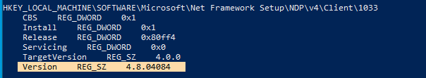

# Repositorio Chocolatey para Windows

 [Documentación oficial Chocolatey][DocumentacionCh]

 [DocumentacionCh]: https://docs.chocolatey.org/en-us/

## Que é Chocolatey?

Chocolatey é un xestor de paquetes e instalador a nivel de máquina para paquetes de software, creado para a plataforma Windows.

O obxectivo é facilitar a instalación de software en equipos Windows, que se atope no [repositorio de paquetes Chocolatey][repositorioChocolatey].

## Requisitos
Para instalar Chocolatey requírese ter (nov 2022):
- Windows 7 ou superior
- Powershell versión 2 ou superior [Ver VersionPS](#Ver)
- NetFramework 2.x ou superior


> Ver versión de Powershell :

1. Executar a aplicacón PowerShell como administrador:


1. Na ventana de comandos escribir **get-host**
E amósase a versión de PowerShell que está correndo no equipo:


Tamén podería executarse **$PSVersionTable**


> Ver versión de NetFramework instalada

Desde a liña de comando escribimos o seguinte código:

`reg query ‘HKLMSOFTWAREMicrosoftNet Framework SetupNDP’ /s`

E podese ver na saída a versión de NetFramework:




## Instalación de Chocolatey en Windows

[Ligazón a documentación oficial sobre a instalación][instalacionChocolatey]

[instalacionChocolatey]: https://docs.chocolatey.org/en-us/choco/setup

**Opción 1. Instalar desde PowerShell**

Para instalar desde PowerShell abrimos a ventana de Powershell, mellor con permisos de administración e tecleamos:

```
 Set-ExecutionPolicy Bypass -Scope Process -Force; [System.Net.ServicePointManager]::SecurityProtocol = [System.Net.ServicePointManager]::SecurityProtocol -bor 3072; iex ((New-Object System.Net.WebClient).DownloadString('https://community.chocolatey.org/install.ps1'))
 ```

En caso e executar esta opción, vese que descarga esse *install.ps1* e o executa, de forma que Chocolatey queda instalado.


**Opción 2: Instalar desde a liña de comandos cmd**

```
@"%SystemRoot%\System32\WindowsPowerShell\v1.0\powershell.exe" -NoProfile -InputFormat None -ExecutionPolicy Bypass -Command "[System.Net.ServicePointManager]::SecurityProtocol = 3072; iex ((New-Object System.Net.WebClient).DownloadString('https://community.chocolatey.org/install.ps1'))" && SET "PATH=%PATH%;%ALLUSERSPROFILE%\chocolatey\bin"
```

## Repositorio de paquetes chocolatey

Para buscar paquetes que existen no repositorio e que podemos installar co comando ` choco install ` accedemos ao [repositorio de paquetes Chocolatey][repositorioChocolatey].

[repositorioChocolatey]: https://community.chocolatey.org/packages

#### Instalar programas da lista **choco install**
`choco install nome-paquete`

Exemplo, instalando GoogleChrome:

`choco install googlechrome`

###### Instalación de forma NON interactiva

Se o que queremos é que non nos faga preguntas nos proceso de instalación, debemos engadir ao final do comando de instalación **-y**

`choco install nomepaquete -y`

Exemplo, instalando 7zip, sen ter que interactuar coa consola:


Si o que queremos é isntala


#### Actualizar programas da lista **choco update**
`choco update nome-paquete`

Para **actualizar todo o software** emprégase **all** ao final do comando.

`choco update all`

#### Listar paquetes **choco list**

`choco list`

#### Buscar paquetes **choco find nome-paquete**
`choco find nome-paquete`

Exemplo:
Buscamos se existe o paquete coa interface gráfica de chocolatey.

`choco find chocolateyGUI`


#### Desinstalar paquetes **choco uninstall**
`choco uninstall nomepaquete`

Por exemplo, se temos instalado firefox a través de Chocolatey, poderíamos desinstalar facendo:

`choco uninstall firefox -y`


### Empregar chocolateyGUI a Interface gráfica de Chocolatey.

Vemos que hai dúas opcións:
1. Busca de programas no equipo local
1. Busca de programas no repositorio Web de Chocolatey. E ademáis indícanos os que temos instalados.


Se queremos instalar, prememos sobre a aplicacón, no exemplo, escollemos Firefox e **instalar**.


## Configurar un script de bat para instalar varios programas con chocolatey

Para automatizar o proceso de instalación de software, poderíamos crear un arquivo **.bat**, e logo executalo. Para que a instalación non sexa interactiva, engadiremos o parámetro **-y** ao facer as instalación, para que non realice preguntas ao usuario.

> Por exemplo: imaxinamos que queremos instlar o seguinte software:
- Google chrome
- firefox
- Adobe acrobat reader
- 7zip
- Vlc
- Libre Office

Faríamos un script similar ao seguinte e chamámoslle *instalardesatendido.bat*:

```
ECHO Instalación software base do sistema operativo
choco install googlechrome -y
choco install firefox -y
choco install adobereader -y
choco install 7zip -y
choco install vlc -y
choco install libreoffice -y
ECHO FIN DA Instalación
PAUSE
exit
```

Executaríamos o script na liña de comandos:

`c:\swbase\> instalardesatendido.bat`

Instalaría todo o que marcamos no script e finalmente esperaría que premamos ENTER, xa que lle puxemos un PAUSE.
