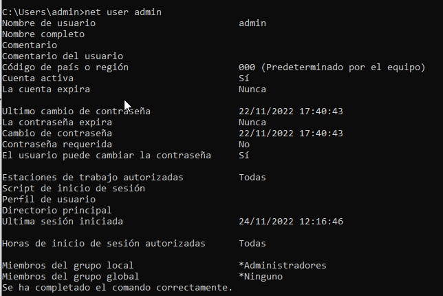

## Creación de usuarios co comando **net user**

Para ver os usuarios do sistema desde a liña de comandos **cmd**:

### `net user`


E alí imos a **Variables de entorno**


Pode verse unha listaxe de usuarios do sistema:
+ **admin**, que é do grupo Administrador e é a conta por defecto *DefaultAccount*. Este usuario é o que se creo **por defecto** na **instalacion de Windows**
+ Contas integradas na instalación de "Windows 10", que é mellor non eliminar e que por defecto veñen **deshabilitadas**
    + **Invitado**, que ven activado por defecto na instalación de Windows, aínda que está deshabilitada.
    + **WDAGUtilityAccount** é unha conta de sistema integrada en Windows, é unha conta de usuario administrada e empregada polo sistema por seguridade, para escenarios de *Windows Defender Application Guard*, a aplicación de protección Windows Defender. EStá deshabilitada por defecto tamén.
    + **DefaultAccount**, conta por defecto.
    + **Administrador** conta por defecto e administador do grupo Administradores e está deshabilitada por defecto.
    Pode verse, na seguinte imaxe que ao listas as características de Administrador di que a conta non está activa.
    

    Como vemos estes usuarios son os mesmos que me lista no entorno gráfico ao acceder a **Administración de equipos** na opción de **Usuarios e grupos locales**, que como se ve os iconos que teñen unha flechiña hacia abaixo, amosan aos usuarios deshabilitados.


## net user nomeusuario
Amosa toda a información do usuario, por exemplo, imos executalo para o usuario "admin".



Pode verse que:
+ A conta está activa
+ Que o contrasinal non expira
+ O usuario pode cambiar o contrasinal
+ Que o usuario é membro do grupo local **Administradores**


## net user novousuario /add

Co comando `net user novousuario /add` engadimos un novo usuario ao sistema.

Para poder crear un usuario desde a liña de comandos, debemos abrir a liña de comandos con permiso de administrador.


Por exemplo, engado o  usuario "cris"
`net user cris /add`

Deste xeito a conta créase sen contrasinal, será o usuario o que teña que introducila se así o considera.

A conta que crea é dentro do grupo **Usuarios**


Se quixera engadirlle unha contrasinal escribiría:

`net user nomenovousuario contrasinalusuario /add`

Se ademáis quixera que o usuario cambie o contrasinal no seguinte inicio de sesión:

`net user nomenovousuario contnovousu /add /LOGONPASSWORDCHG:YES`

Por exemplo, creamos un usuario chamado usuario, con contrasinal usuario e que cambio o contrasinal no seguinte inicio de sesión.


Vemos que creou o usuario, iso sí, ata que o usuario inicie sesión no equipo, non creará en *c:\Users\* a carpeta persoal do mesmo.


Cando iniciemos sesión con ese usuario solicitaranos o contrasinal:


## Outras opcións ao crear usuarios
Cando creamos usuarios, pódense utilizar todoas as seguintes opcións, que se amosan ao facer `net user help`


## Borrar un usuario net user /delete

Para borrar un usuario execútase:

`net user nomeusuario /delete`

## Creando un script .bat para automatizar Creación

[Manual básico de batch por Rafael Santos](https://www.rafaelsantos.es/web/agora/Programaci%C3%B3n%20BATCH.pdf)

Imos crear un arquivo por lotes, é dicir, un arquivo que vaia executando automáticamente todas as instruccións que introducimos nel.

Revisamos uns comandos:
+ @echo off para que so amose por pantalla o indicado en ECHO
+ REM para escribir un comentario
+ ECHO para amosar por pantalla
+ PAUSE fai unha pausa e espera a pulsar ENTER.
+ SET para darlle valor a variables

Os parámetros dentro do programa léense con **%1** o primeiro, **%2** o segundo e así sucesivament ata nove parámetros como máximo.

Por exemplo, imos facer un script **crearusuarios.bat** ao que lle pasemos o nome dun usuario como parámetro e cree ese usuario se non existe co contrasinal "abc123." e lle solicite ao usurio cambiar o  contrasinal unha vez inicie sesión.

```
@echo off
REM Declaramos unha variable nomeusuario
set nomeusuario=%1

echo INICIANDO CREACIÓN Usuario
echo CREANDO USUARIO %nomeusuario%
REM créase o usuario
net user %nomeusuario% abc123. /add /LOGONPASSWORDCHG:Y
```
Por exemplo, se executamos agora o ficheiro .bat, *Lembrar que hai que abrir unha consola con permisos de ADMINISTRADOR*

`crearusuarios.bat usuDaw`
A salida será:


> [Ligazón ao ficheiro crearusuarios.bat](script/crearusuarios.bat)

Se queremos crear o usuario sempre que se lle pase un parámetro ao ficheiro, empregaríamos unha sentenza **IF-ELSE** e a demais comprobar se se lle pasou un parámetro, o que se comproba empregando **%1**:
```
IF condición (
  Se se cumpre a condición
  ) ELSE (
    Se non se cumpre a condición
    )
```
Así que o código podería quedar así:

```
@echo off

set nomeusuario=%1

echo INICIANDO PROGRAMA

if "%1"=="" (
echo DEBES INTRODUCIR O NOME DUN USUARIO
) else (
    echo Creando usuario %nomeusuario%
    net user %nomeusuario% abc123. /add /LOGONPASSWORDCHG:YES
    echo Usuario creado
    net user %nomeusuario%
)
echo Fin
```
Agora se non lle pasamos parámetros a saída sería:


E si lle pasamos un usuario crearíao:


Tamén se poden capturar os erros con **ERRORLEVEL** para indicar por exemplo que o script hai que executalo con permisos de administrador, poderíamos facer:
```
@echo off


set nomeusuario=%1

echo INICIANDO PROGRAMA

REM Comprobando se eres administrador, redirecciona saída a nul 2

net session >nul 2>&1
if %errorLevel% ==0 (
	REM Se non hai erros
	echo Eres administrador, puedes crear usuarios
	GOTO:crearusuarios
) else (
	echo Tes que executar o script con permisos de administrador
)

:crearusuarios
	if "%1"=="" (
		echo DEBES INTRODUCIR O NOME DUN USUARIO
	) else (
		echo Creando usuario %nomeusuario%
		net user %nomeusuario% abc123. /add /LOGONPASSWORDCHG:YES
	)


echo Fin
```
+ Rediríxixe a saída con **>nul 2>&1**
+ Se **%errorLevel%%==0** isto indica que non houbo erro, en caso contrario sí o houbo.
+ Con **GOTO** accédese ao bloque de código ao que se refire o GOTO, neste caso a **:crearusuarios**

> [Acceso ao código do script de creación de usuarios capturando os erros](script/crearusuarioscapturaerrores.bat)
