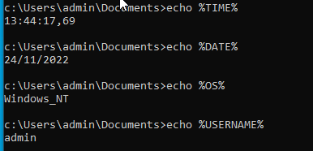
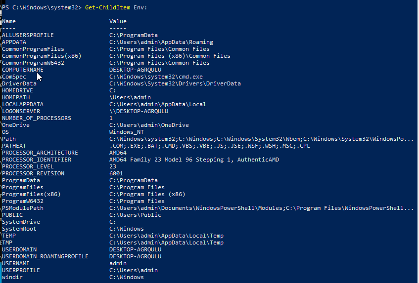
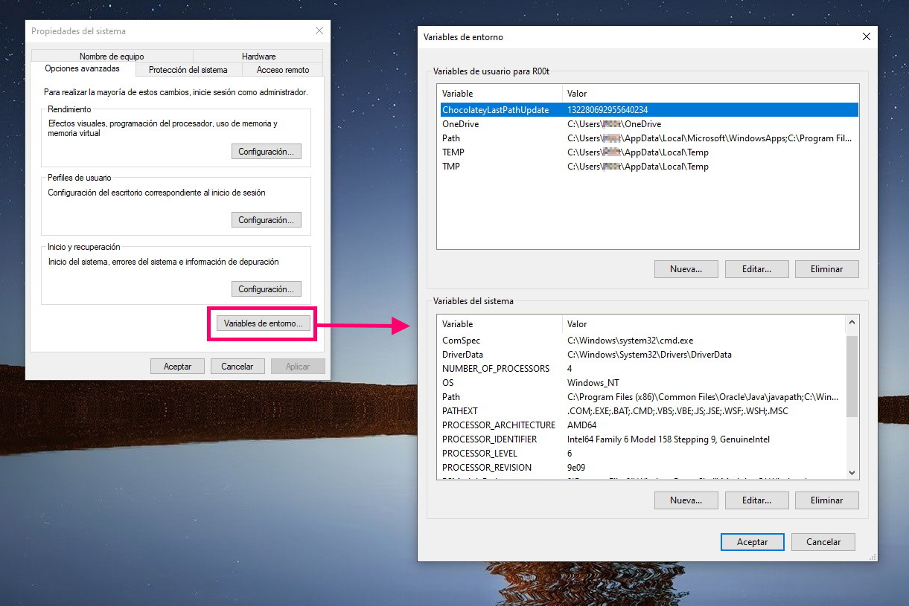

## As variables de entorno

En Windows hai definidas unhas variables de entorno e unhas variables do sistema, ás que podemos acceder ao seu valor empregando **%nomevbleentorno%**

Son útiles para automatizar procesos, a través do CMD ou do Powershell.

Podemos velas desde a consola, executando ECHO %NOMEVARIABLE%

Na seguinte imaxe poden verse as variables TIME, DATE, OS, USERNAME:

Podemos listar as variables desde o Powershell tecleando `Get-ChildItem Env:`

Tamén se poden ver desde

