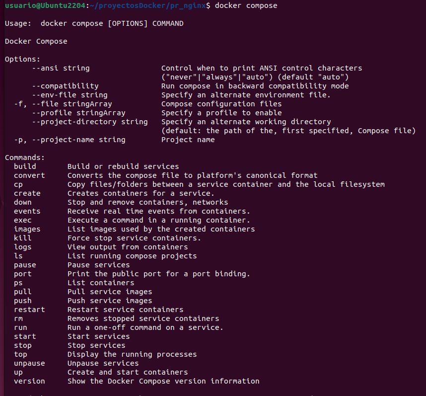
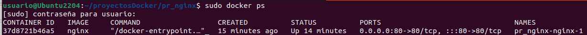
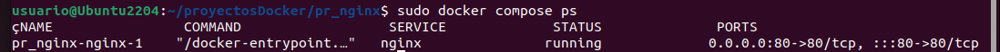
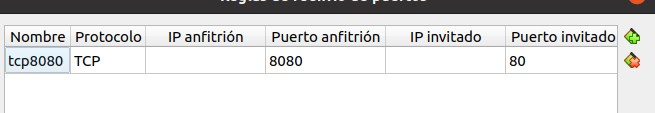
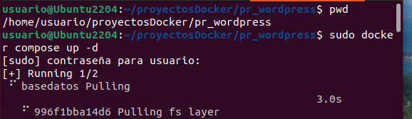
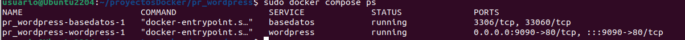
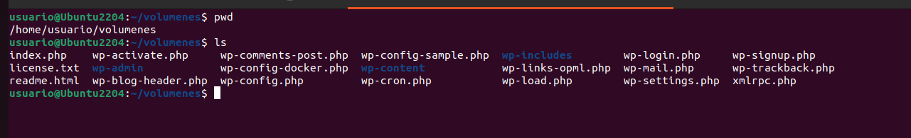
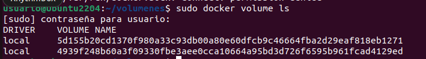
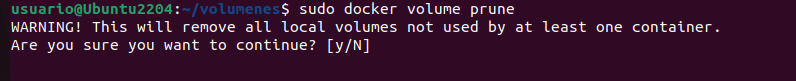

# Docker-compose

 ## Instalar docker en caso de non telo instalado

> [Instalación en Linux](https://docs.docker.com/desktop/install/linux-install/)

Imos instalar Docker Desktop empregando os repositorios, para elo seguimos a documentación da páxina de información de docker:
> [Instalar Docker Desktop en Ubuntu ](https://docs.docker.com/engine/install/ubuntu/#set-up-the-repository)
+ Instala Docker engine
+ Instala Docker compose

### Instalar docker-compose solamente

Hai dúas versións para a instalación de Docker-compose, a versión antiga e a versión **v2**

> + [Ligazón á documentación de instalar Docker Compose](https://docs.docker.com/compose/install/)

> + [Ligazón á v2 de docker compose](https://docs.docker.com/compose/compose-v2/)

Para saber a versión que temos podemos executar:
+ Versión antigua **v1**: `docker-compose version`
+ Versión v2: `docker compose version`
!['Version']
(images/version.png)

O comando para lanzar na versión antiga **v1** é **docker-compose**, cun **-** entre as dúas palabras. `docker-compose up`

O comando para lanzar na versión v2 é **docker compose** sen **-**, separado por un espazo soamente.  `docker compose up`

Para ver que podemos executar con **docker compose** escribimos este comando na consola, e amosa as opcións:



## Ficheiro yaml

En docker compose, o ficheiro **.yaml** ou **.yml**, contén as instruccións para xerar un entorno multicontedor.

Haberá que incluir:
+ Redes
+ Volumes
+ Variables de entorno
+ Interelacións entre eles
+ etcétera

Yaml, é un formato de serialización, non é unha linguaxe de marcado. Convertiuse nun estándar porque é moi bo para crear ficheiros de propiedades ou de características, porque ten unha sintaxe moi estricta.
> [Información sobre Yaml na Wikipedia](https://es.wikipedia.org/wiki/YAML)

Está composto con claves: valor, despois dos **:** vai un **espazo en branco**. É moi importante manter a **indentación**.

Por exemplo:

```
services:
  wordpress:
    image: wordpress
    restart: always
    environment:
      WORDPRESS_DB_HOST: db
      WORDPRESS_DB_USER: exampleuser
      WORDPRESS_DB_PASSWORD: examplepass
      WORDPRESS_DB_NAME: exampledb
    volumes:
      - wordpress:/var/www/html
```
## Comandos para a xestión de Contenedores: up, stop, down

+ Iniciar un contenedor: up
`docker compose up`

+ Para Contenedores: stop
`docker compose stop`

+ Deter e eliminar contenedores: down
`docker compose down`

## Primeiro exemplo: Servidor nginx

Este exemplo é moi sinxelo. Imos facer un exemplo co servidor Web **nginx**.

En Docker-compose trabállase no término de **proxecto**, que se refire a todo o entorno que imos lanzar co Docker-compose. Así que **creamos unha carpeta** co nome do proxecto.

`mkdir pr_nginx`

Creamos dentro o ficheiro **docker-compose.yml**

```
version: '3'
services:
  nginx:
    image: nginx
    ports:
    - "80:80"
```
O nome do servizo, neste caso "nginx" é personalizable, poderíamoslle por outro. Sen embargo, a imaxe que imos empregar é do [repositorio de imaxes de docker hub](https://hub.docker.com/search?q=), e debe levar o nome da imaxe no repositorio oficial [**"nginx"**](https://hub.docker.com/_/nginx).

#### Lanzamos en  modo interactivo para ver a saída

Entramos no directorio do proxecto e lanzamos o ficheiro que acabamos de crear no exemplo anterior:

O comando para lanzar na versión antiga é **docker-compose**, cun **-** entre as dúas palabras. `docker-compose up`

O comando para lanzar na versión v2 é **docker compose** sen **-**.  
`docker compose up`


En posteriores exemplos, cando esteamos en produción empregaremos **-d** para lanzalo en background, pero neste exemplo imos facelo interactivo para ver os resultados que amosan.

A rede que se emprega neste exemplo, é a rede por defecto, aínda que para unir os contenedores, ***recoméndase crear unha rede propia***.


Vese como crea o contedor.
Si accedemos desde o navegador a [http://localhost:80](http://localhost:80) vése que está a funcionar o nginx.

Na saída da Consola pode verse como nos conectamos desde un cliente con ip *172.18.0.1*, desde un navegador *Mozilla* e que se accede ao host *localhost*.

Se facemos agora un `docker ps`, vemos o contedor que acaba de crear, que vemos que é un contenedor normal, xa que o que fai docker-compose é facilitar a creación dos mesmos.



Se facemos un `docker compose ps` vemos o entorno de microcontedores que creou:



### Acceder desde o equipo local HOST da aula

En virtualBox, creamos unha redirección de portos, imos redireccionar o porto 80 do 8080.



E si conectamos agora *desde a nosa máquina host* (a física).


## Docker-compose exemplo multimáquina: wordpress e mysql

Imos crear:
+ Un contedor de **WORDPRESS**, chamado "wordpress"
+ Un contedor de **Mysql**, chamado "basedatos"

```
services:

  wordpress:
    image: wordpress
    restart: always
    ports:
      - 9090:80  
    environment:
      WORDPRESS_DB_HOST: basedatos
      WORDPRESS_DB_USER: wpuser
      WORDPRESS_DB_PASSWORD: renaido
      WORDPRESS_DB_NAME: bdwordpress
    depends_on:
      - basedatos

  basedatos:
    image: mysql
    restart: always
    environment:
      MYSQL_DATABASE: bdwordpress
      MYSQL_USER: wpuser
      MYSQL_PASSWORD: renaido
      MYSQL_ROOT_PASSWORD: Abc123.

```
Do contedor wordpress:

+ **image**: indica que imaxen ten que descargar de Docker Hub, neste caso wordpress.
+ **restart**: que se reinicie o servizo sempre.
+ **ports**: neste caso emprega o porto 80 do docker, e o 9090 do equipo host, desde onde se chama ao docker.
+ **environment**: son variables de entorno que necesita o servizo para funcionar. Destacar:
    + WORDPRESS_DB_HOST: hai que poñer o nome do contedor que da o servizo, neste caso **"basedatos**", o nome do host que ten a base de datos.
    + WORDPRESS_DB_NAME: aquí hai que indicar o nome da base de datos dentro de mysql, que vai empregar wordpresss, neste caso **"bdwordpress"**.
+ **depends_on**: indicámoslle que para que se execute este contedor, antes debe estar iniciado o que poñemos neste apartado de depends_on, neste caso "basedatos"

Do contedor basedatos:

+ image: instancia a imaxe de mysql.
+ **restart**: sempre.
+ **environment*: indica as variables de entorno:
    + MYSQL_DATABASE: poñemos o nome da base de datos que emprega wordpress dentro do servidor mysql, neste caso *"dbwordpress"*.
    + MYSQL_USER: indica o usuario para acceder á base de datos de wordpress, "bdwordpress"
    + MYSQL_PASSWORD: o contrasinal do usuario da "bdwordpress".
    + MYSQL_ROOT_PASSWORD: indicamos o contrasinal do root do servizo de mysql.

### Levantando os servizos de wordpress e mysql con docker Compose

Dentro da carpeta do proxecto, execútase`docker compose up -d`, poñemos o *-d* para facelo en background.


Vése que comeza a cargar o docker de *basedatos*, xa que no *depends_on* lle indicamos que o servizo de wordpress dependía de *basedatos*.

Unha vez que acaba de crear os dous contedores, entramos en [http://localhost:9090](http://localhost:9090), e podemos ver que inicia a instalación de wordpress:


Finalmente aparece finalizada a instalación de wordpress:
.

Agora ao acceder a [http://localhost:9090](http://localhost:9090) aparece o xestor de configuración de wordpress:


Se executamos `sudo docker compose ps` vemos os contedores que se están executando:


### Configuración dun volume

Creamos un espazo persistente, desde o que poder acceder desde a máquina host, á carpeta de configuración de wordpress, neste caso **/var/www/html**.


Podemos montar:
+ **docker volumes**: asigna automáticamente un nome aos volumes, xeralmente é un nome moi longo, polo que non se recomenda esta opción. Logo móntaos en **/var/lib/docker/volumes/**
+ **named volumes**: onde lle damos nós un nome ao volume. Logo dentro da máquina host, se accedemos a */var/lib/docker/volumes/* podemos ver os volumenes compartidos cos contenedores.

+ **bind volume**: indicamos no directorio da máquina real no que queremos que comparta o volume, por exemplo: */home/usuario/compartido*
Se facemos un `docker inspect nomecontedor`, pódese ver a configuración, e no mount, aparece que é de tipo *bind*.
Engadimos o volume para wordpress:

```
volumes:

  -/home/usuario/volumenes:/var/www/html

```

Indica que indexamos a nosa carpeta de host: ***/home/usuario/volumenes*** coa carpeta do servidor ***/var/www/html***

```
services:

  wordpress:
    image: wordpress
    restart: always
    ports:
      - 9090:80
    environment:
      WORDPRESS_DB_HOST: basedatos
      WORDPRESS_DB_USER: wpuser
      WORDPRESS_DB_PASSWORD: renaido
      WORDPRESS_DB_NAME: bdwordpress
    depends_on:
      - basedatos
    volumes:
      -/home/usuario/volumenes:/var/www/html

  basedatos:
    image: mysql
    restart: always
    ports:
      - 3306:3306
    environment:
      MYSQL_DATABASE: bdwordpress
      MYSQL_USER: wpuser
      MYSQL_PASSWORD: renaido
      MYSQL_ROOT_PASSWORD: Abc123.

```

Vemos que dentro da carpeta ***/home/usuario/volumenes*** teño acceso á carpeta de wordpress /var/www/html.



#### Ver lista de volúmenes

Se queremos comprobar os volúmenes compartidos con docker facemos `docker volume ls`.



#### Borrar todos os volúmenes

Se quero borrar todos os volumes na máquina host `docker volume prune`


---
Documentos empregados:
- [compose.yml](compose.yml)
- [docker-compose-ex1.yml](docker-compose-ex1.yml)
- - -
###### *Creado por Cristina Puga Barreiros ©2023*


    
