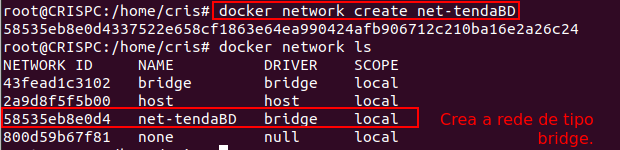
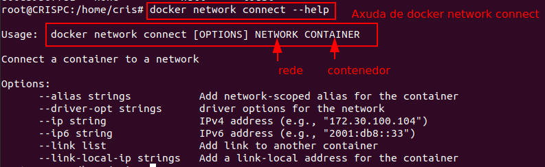
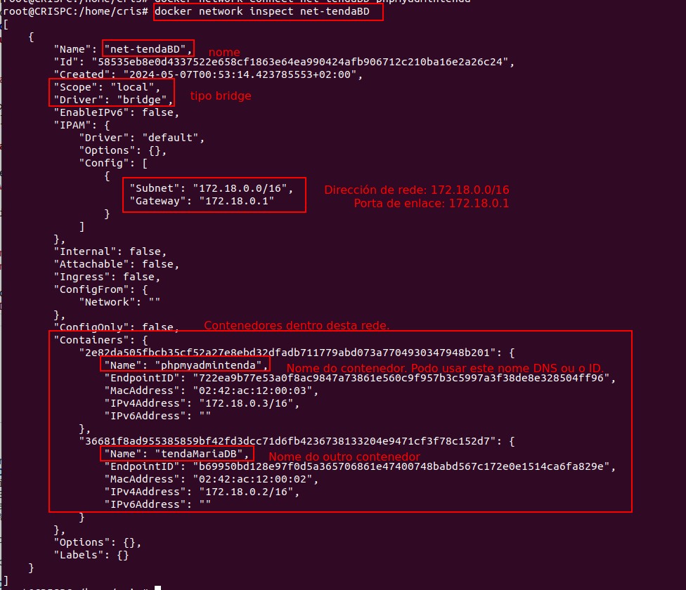
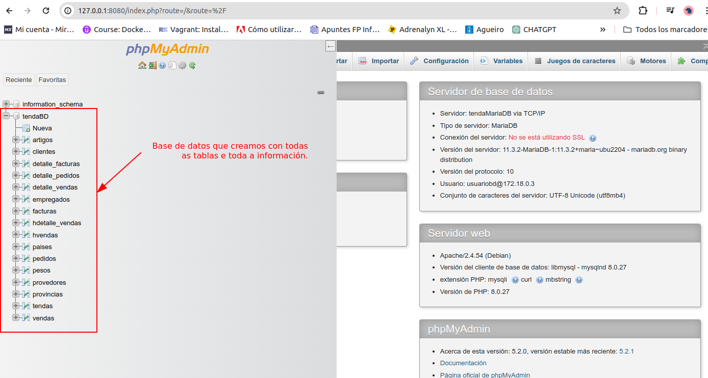

### Crear unha rede entre dous contenedores

##### Obxectivo
Poder conectar os contenedores de tendaMariaDB e phpmyadminTenda.

##### Situación de partida

Por defecto, docker ten as seguintes redes:

Pero nós imos crear unha rede específica, na que estarán os dous contenedores, é dicir, **os dous contenedores terán unha interface de rede nesta nova rede**.
### Paso 1: Crear unha rede

```bash
docker network create net-tendaBD
```
Despois de creala xa vemos que aparece nas nosas redes por defecto:


### Paso 2: Conectar os contenedores/docker a esta nova rede - docker network connect
Se vemos a axuda de ```docker network connect --help```


Conectamos do seguinte xeito

```bash
docker network connect net-tendaBD tendaMariaDB
docker network connect net-tendaBD phpmyadmintenda
```
Agora xa estarían os dous na mesma rede. Se facemos ```docker network inspect net-tendaBD```


### Paso 3: Colocar o nome do servidor en phpMyAdmin

Agora podemos volver á web de phpmyadmin: http://127.0.0.1:8080 e poñer o nome do servidor, que será **tendaMariaDB**


E unha vez entramos vemos que está toda a información da Base de datos:


### Revisión: Asignación de rede desde a instancia do contenedor
Poderíamos asignar a rede desde a instancia do contenedor, sería engadirlle á instancia a seguinte liña: **```--network net-tendaBD```** tendo en conta que a rede xa está creada, quedaría a instancia do seguinte modo.

```bash
docker run \
--name phpmyadmintenda \
-d \
-e PMA_ARBITRARY=1 \
-p 8080:80 \
--network net-tendaBD \
phpmyadmin:5.2.0-apache
```

E o mesmo coa instancia de tendaMariaDB:

```bash
docker container run \
-dp 3306:3306 \
--name tendaMariaDB \
--env MARIADB_USER=usuariobd \
--env MARIADB_PASSWORD=passwordusuariobd \
--env MARIADB_ROOT_PASSWORD=Abc123 \
--env MARIADB_DATABASE=tendaBD \
--volume tendaBD:/var/lib/mysql \
--network net-tendaBD \
mariadb:jammy
```
---
Realizado por:
 
2024 - Cristina Puga Barreiros @crispuga
