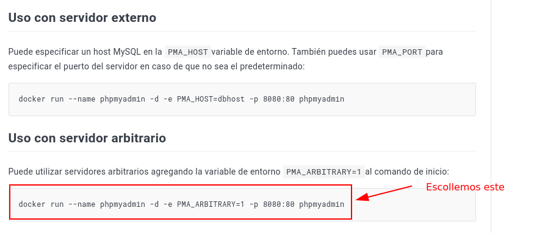
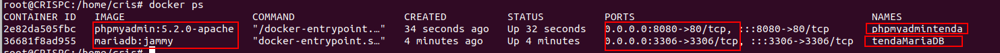
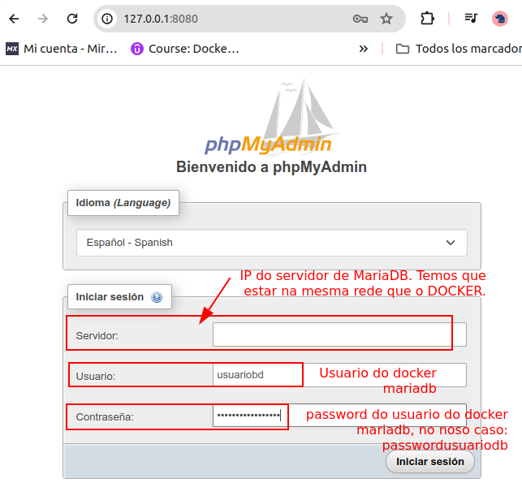

### Docker PhpMyAdmin para acceder a mariaDB

##### Obxectivo

Correr o servizo PHPMyAdmin, que me permite conectar coa base de datos mariaDB desde un servizo Web.
Para configuralo, necesitamos que este servizo faga uso dun servidor Web. E **desde o docker de PhpMyAdmin, accederemos á base de datos de mariadb**.

Neste suposto terei **dous contenedores/docker correndo**:
1) tendaMariaDB
1) phpmyadmintenda

Polo tanto, manteño correndo o contenedor creado co [volumen persistente de MariaDB](dockertendabdmariaDB-Volumes.md), e logo instanciarei o novo de PhpMyAdmin.
## Paso 1: Instanciar o docker de phpmyadmin

Accedemos á documentación de [PHPMyAdmin en Docker Hub](https://hub.docker.com/_/phpmyadmin), vemos que se pode instanciar dous tipos de servidores: **Servidor externo** (sería que un servidor externo corre o servizo http e https) e **servidor arbitrario**, que indica que un servidor arbitrario corre o http, é dicir dentro do mesmo docker. Será o que **usemos, servidor arbitrario**.



```bash
docker run \
--name phpmyadmintenda \
-d \
-e PMA_ARBITRARY=1 \
-p 8080:80 \
phpmyadmin:5.2.0-apache
```
Onde:
- *phpmyadmin:5.2.0-apache*  empregamos a versión 5.2.0-apache de phpmyadmin.
- *-e PMA_ARBITRARY=1* indicamos que é un servidor arbitrario.
- *-p 8080:80* mapeo o porto 8080 do host, ao porto 80 do docker.

##### Contenedores en execución
Vemos que os dous contenedores están en execución:


### Paso 2: Accedemos a PhpMyAdmin: http://127.0.0.1:8080

Conectamos co contenedor de PhpMyAdmin.



Debemos configurar:
- usuario: o usuario que definimos no contenedor de **tendaMariaDB**
- Contraseña: a que definimos para o usuario no contenedor de **tendaMariaDB**
- Servidor: debemos indicar a dirección do servidor.

**PROBLEMA:**
O problema que temos é que os dous contenedores deben de estar na mesma rede, para poder acceder de un ao outro. 

**SOLUCIÓN** 
Crear una red entre los dos contenedores.

---
Realizado por:
 
2024 - Cristina Puga Barreiros @crispuga
