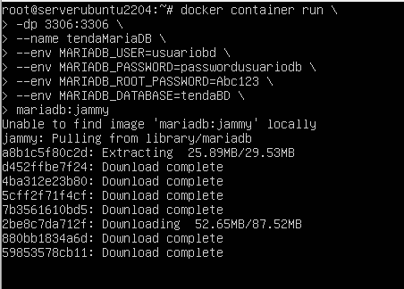
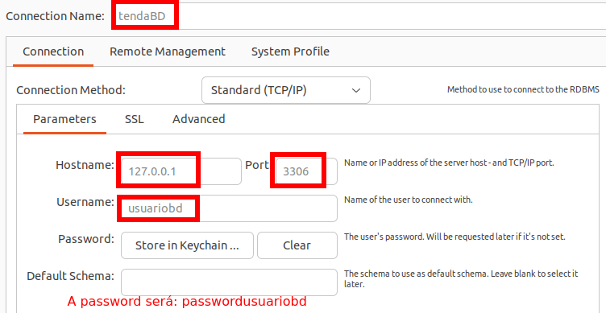
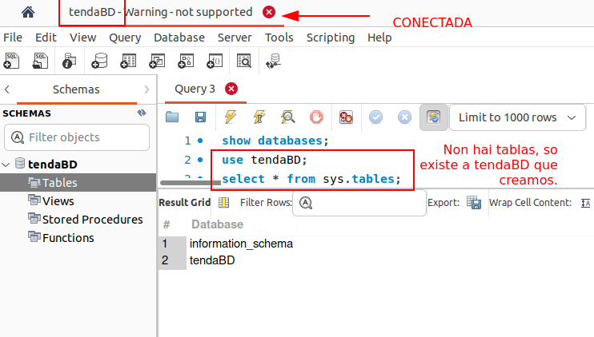
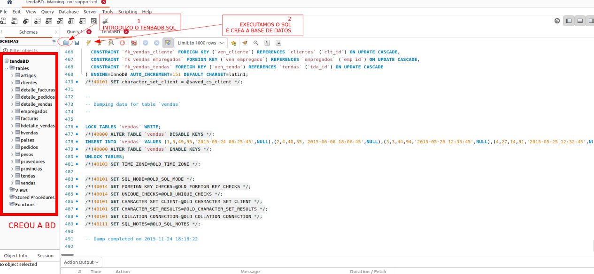
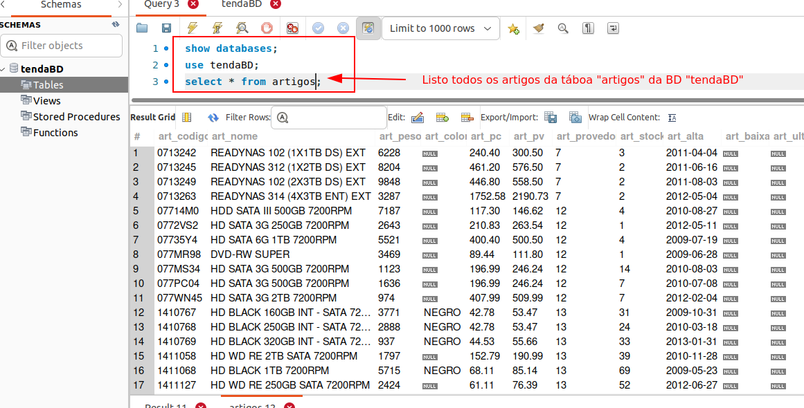

## Instanciar docker MARIADB e crear unha BD propia
#### Obxectivo
O obxectivo é instanciar un **DOCKER** que corra **MariaDB**, e no que imos crear unha base de datos propia chamada **tendaBD**.

###### Pasos:

- Instanciaremos o docker/contenedor co servizo MariaDB correndo.
- Accederemos ao MariaDB que corre no Docker con WorkBech ou con TablePlus
- Conectados a mariaDB, lanzaremos o noso ficheiro de creación da base de datos [tendaBD.sql](scripts/tendaBD.sql)
- Crearase a base de datos tendaBD e poderemos traballar con ela

###### Limitacións da práctica: 
- Cando pechemos o docker e o borremos, se volvemos lanzalo, xa non conterá a nosa base de datos tendaDB, polo que habería que volver a creala.

###### Solucións- facer BD Persistente usando VOLUMES:
Despois de facer a práctica, a solución que se plantexa é crear un **volume** que enlace á carpeta na que se gardan os datos de **MariaDB**, que no caso da versión **mariadb:jammy** é **/var/lib/mysql**, deste xeito, no volume gardanse os cambios que se fagan en mariaDB, e a seguinte vez que se instancie o volume, os datos estarán ahí persistentes.

### Paso 1: Instanciar o Docker/Contenedor de MariaDB e configurar variables de entorno de MariaDB para o acceso

- Os datos das **variables de entorno** de mariaDB serán, usuario "usuariobd" o contrasinal do usuario será "passwordusuariobd", o contrasinal do root será "Abc123", e o nome da base de datos será "tendaBD":
    * MARIADB_USER=usuariobd
    * MARIADB_PASSWORD=passwordusuariobd
    * MARIADB_ROOT_PASSWORD=Abc123
    * MARIADB_DATABASE=tendaBD
- Para acceder a BD, empregarase o **porto 3306 do contenedor/docker** e redireccionarase ao **porto 3306 do HOST onde corre docker**.
- O nome do contenedor/docker que imos crear será: **tendaMariaDB**
- A imaxe de mariadb será: **mariadb:jammy**

---

A **instancia DOCKER** con estas características será:
```bash
docker container run \
-dp 3306:3306 \
--name tendaMariaDB \
--env MARIADB_USER=usuariobd \
--env MARIADB_PASSWORD=passwordusuariobd \
--env MARIADB_ROOT_PASSWORD=Abc123 \
--env MARIADB_DATABASE=tendaBD \
mariadb:jammy
```
A primeira vez que se instancia á imaxe **mariadb:jammy** descárgaa do repositorio, como pode verse na seguinte imaxe:

###### Docker creado - Listar contenedores - docker ps

E facendo un ``docker ps `` ou ``docker container ls `` vemos o estado do noso contenedor-docker.


### Paso 2: Conectámonos co mariadb do docker con WorkBench ou similar

Desde WorkBench, TablePlus ou outra ferramenta similar, preaparmos a cadena de conexión:
- Hostname: 127.0.0.1 (Xa que o servizo mariaDb está redireccionado ao host a través do porto 3306)
- Porto: 3306 (que é o que redireccionamos *-dp 3306:3306* ao instanciar o docker)
- Usuario: usuariobd (que é o que indicamos *--env MARIADB_USER=usuariobd*)
- Contrasinal: passwordusuariobd (será a que indicamos na variable de entorno *--env MARIADB_PASSWORD=passwordusuariobd*)

Na seguinte imaxe pode verse a configuración empregada para conectar desde o Host (onde corre docker) co Docker *tendaMariaDB*



E vemos que entramos en MariaDB, pero que so está creada a BD, as tablas non existen.



### Paso 3: Crear as tablas co ficheiro [tendaBD.sql](scripts/tendaBD.sql)

Abrimos unha nova consulta en WorkBench, e abrimos o ficheiro [tendaBD.sql](scripts/tendaBD.sql).

Executamos a consulta, e vemos que **creou a BASE DE DATOS** con un montón de tablas.



Se facemos unha consulta por exemplo de todos os artigos da táboa artigos danos unha saída:



##### DOCKER FUNCIONANDO E BASE DE DATOS CREADA, pero non persistente.
 
Se pecho o docker ```docker stop tendaMariaDB``` e logo volvo a executalo ```docker stop tendaMariaDB```, a base de datos e os datos introducidos continúan existindo.

**PROBLEMA**: 
Se borramos o docker ```docker rm -r tendaMariaDB```, cando o volvamos instanciar, a base de datos creada coas súas tablas e as modificacións que fixemos nela, xa non están. Estaría vacío e teriamos que comezar desde o punto inicial, perdendo as modificacións feitas.

**Solución**:
 crear un **Volume persistente** , de forma que unha vez eliminado o docker, a modificación dos datos da base de datos quedan no volume.

 Vese no [seguinte documento](dockertendabdmariaDB-Volumes.md).
 
 ---
Realizado por:
 
2024 - Cristina Puga Barreiros @crispuga

