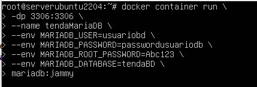

## Instanciar docker MARIADB

1) Instancia da imaxe de MariaDB: 

1) Imos montar a imaxe e **tendaMariaDB**, imos publicar no  **porto 3306 do contenedor** co **porto 3306 do noso PC onde corre docker**.
O nome do contenedor será **tendaBD**.
Imos empregar as seguintes variables de entorno:

    * MARIADB_USER=usuariobd
    * MARIADB_PASSWORD=passwordusuariobd
    * MARIADB_ROOT_PASSWORD=Abc123
    * MARIADB_DATABASE=tendaBD

1) Logo conectarémosnos con WorkBench ou Tableplus á base de datos empregando o usuario **"usuariobd"** á base de datos **tendaBD**.

1) Executamos a query de creación de tablas de tendadb.
1) Ver que se introduxeron os datos
---

Facemos desde a liña de comandos desde o PC onde corre Docker:
```bash
sudo docker container run \
> -dp 3306:3306 \
> --name tendaMadriaDB \
> --env MARIADB_USER=usuariobd \
> --env MARIADB_PASSWORD=passwordusuariobd \
> --env MARIADB_ROOT_PASSWORD=Abc123 \
> --env MARIADB_DATABASE=tendaBD \
> mariadb:jammy
```


Neste momento, procede a descargar a imaxe de mariadb:jammy.

E facendo un ``docker ps `` ou ``docker container ls `` vemos o estado do noso contenedor-docker.


Conectamos desde WORKBENCH.


Introducimos o ficheiro tendaBD.sql e vemos que se crea.


DOCKER FUNCIONANDO E BASE DE DATOS CREADA.
 
O malo que ao pechar o docker, desaparecerá a base de datos.