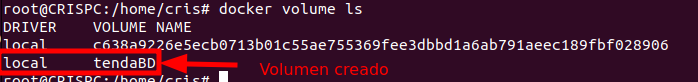
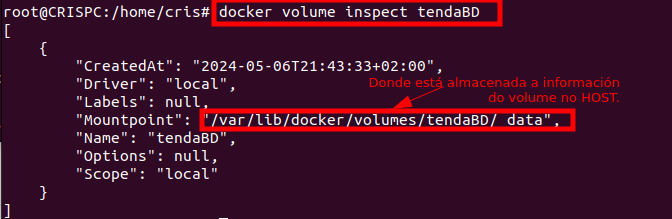
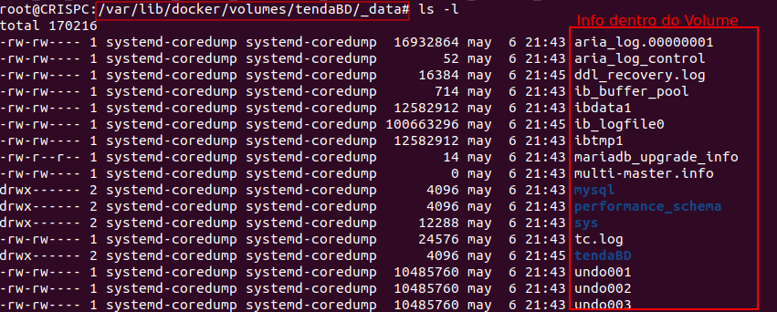
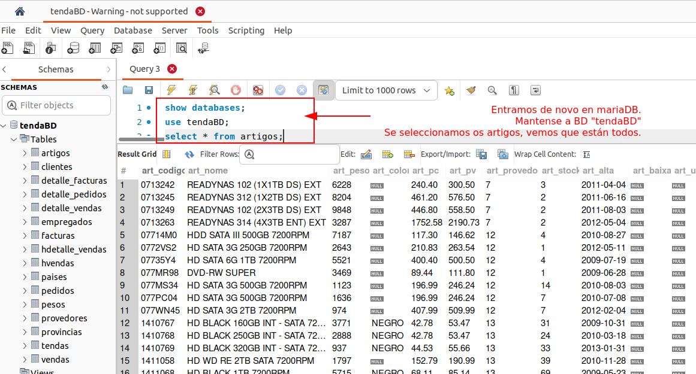

## Volúmenes en Docker (bind volumes) neste caso para facer BD persistente

Para resolver esta circunstancia, o que faremos é compartir unha carpeta co docker. Para elo definimos un **volume**

**```--volume nomeVOLUME:ruta_que_enlaza_no_docker```**

Na instancia ao docker engadimos esta liña e volvemos a executar:

```bash
docker container run \
-dp 3306:3306 \
--name tendaMariaDB \
--env MARIADB_USER=usuariobd \
--env MARIADB_PASSWORD=passwordusuariobd \
--env MARIADB_ROOT_PASSWORD=Abc123 \
--env MARIADB_DATABASE=tendaBD \
--volume tendaBD:/var/lib/mysql \
mariadb:jammy
```
Onde: 
- **/var/lib/mysql**  é onde garda a información da BD *mariaDB:jammy*.
- **-p 3306:3306**  son os *"porto host onde se redirecciona: porto docker"* onde corre mariadb.

### Bind volumes

Si lanzamos o contenedor deste xeito, estamos direccionando o volumen **tendaBD** do noso **host**, á **/var/lib/mysql** do **docker**.

##### Estado do VOLUME
Facendo un ```docker volume ls``` podemos listar os volumes en funcionamento.

Vemos que existe o volumen **tendaBD** que acabamos de instanciar.

##### Inspeccionar o VOLUME
Podemos ver a información do volume con ```docker volume inspect tendaBD```


Vemos que no **host** é dicir no **pc onde corre docker**, o volumen está almacenado en **/var/lib/docker/volumes/tendaBD/_data**.

Se vemos o contido desde directorio é o seguinte:


### VOLUMEN PERSISTENTE - Ao levantar o Docker permanece a información

1) Paramos o docker anterior  ```docker stop tendaMariaDB```.

1) Eliminamos o contenedor ``` docker rm -f tendaMariaDB```

1) Ao volver a levantalo, vemos se os datos da base de datos creada anteriomente persisten ou non.

```bash
sudo docker container run \
-dp 3306:3306 \
--name tendaMariaDB \
--env MARIADB_USER=usuariobd \
--env MARIADB_PASSWORD=passwordusuariobd \
--env MARIADB_ROOT_PASSWORD=Abc123 \
--env MARIADB_DATABASE=tendaBD \
--volume tendaBD:/var/lib/mysql \
mariadb:jammy
```
Vemos que nos conectamos con TablePlus ou WorkBench, coa conexión creada antes, e vemos que **a información da BD persiste**, porque aínda que se eliminou o contenedor, o volume coa información da BD persiste.



---
###### FICHEIROS DE DESCARGA PARA FACER A PRÁCTICA:
- Ficheiro sql: [tendaBD.sql](scripts/tendaBD.sql)