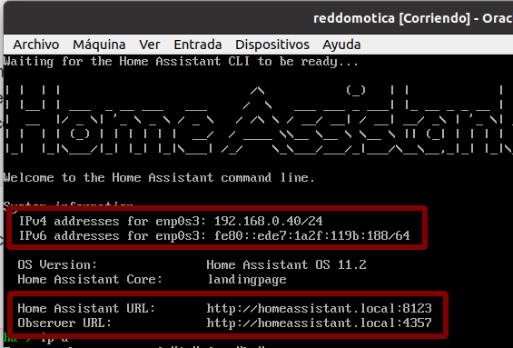

## Configurar Home Assistant en máquina virtual VBox Linux

### Instalar desde as instruaccións de HomeAssistant

https://www.home-assistant.io/installation/linux

1) Descargar o disco duro.
2) Configurar máquina virtual

