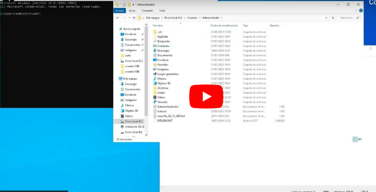

## Que son os Scripts de Batch?
Os scripts de batch (.bat ou .cmd) son arquivos de texto plano, que conteñen unha serie de ordes para executar na consola de comandos de Windows (CMD). 

Estes arquivos gárdanse coa **extensión .bat ou .cmd** para indicar que son scripts de batch. 

Os scripts de batch son unha ferramenta útil para **automatizar tarefas complexas e realizar operacións repetitivas** en Windows.

## Vantaxes dos scripts
Os scripts de batch teñen varias vantaxes:

+ **Aforran tempo**: Os scripts de batch permiten automatizar tarefas complexas e realizar operacións repetitivas de forma rápida e sinxela.
+ **Facilidade de uso**: Os scripts de batch son arquivos de texto plano, o que os fai fáciles de ler e comprender. Ademais, é fácil editalos para cambiar ou engadir liñas de comandos.
+ **Portabilidade**: Os scripts de batch pódense executar en calquera computadora con Windows, o que os fai facilmente transportables.
## Como crear un script de batch?
Créanse cun editor de textos, en Windows existe o editor de textos **NOTEPAD** ou **BLOC DE NOTAS**.
Dentro do editor, escribimos os comandos que se queren executar e logo gárdanse coa **extensión .bat**.

> OLLO!!: A **extensión debe ser .bat**, coidado con non poñer .bat.txt.

Exemplo de ficheiro .bat:

```bat
@echo off
REM iniciarwebteis.bat
REM Ficheiro que inicia a páxina do IES de Teis no navegador por defecto
start www.iesteis.es
```
Este script, o que fará será abrir no navegador por defecto do sistema a páxina "www.iesteis.es".

O comando **@echo off** elimina da saída por pantalla que apareza o prompt do sistema en cada saída.

Unha vez escribamos o script, debemos gardalo, neste caso gardamos co nome **iniciarwebteis.bat** ou tamén seviría poñer **iniciarwebteis.cmd**.

## Execución dos ficheiros .bat
Para executar un ficheiro, soamente debemos poñer no prompt do sistema o nome.
**`> iniciarwebteis.bat`**

[](https://youtu.be/i1MR2cTVSlY?si=6DYNuAHjtG2dFBJd)

