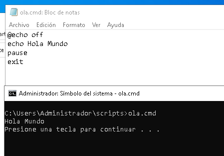
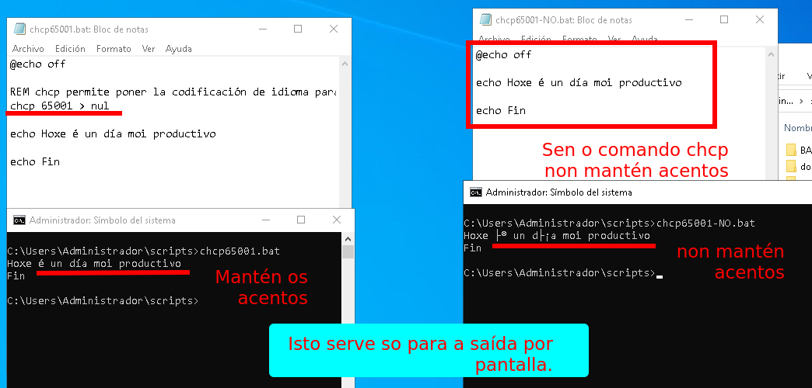
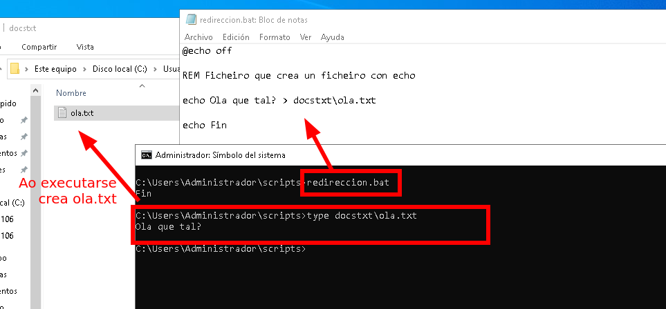
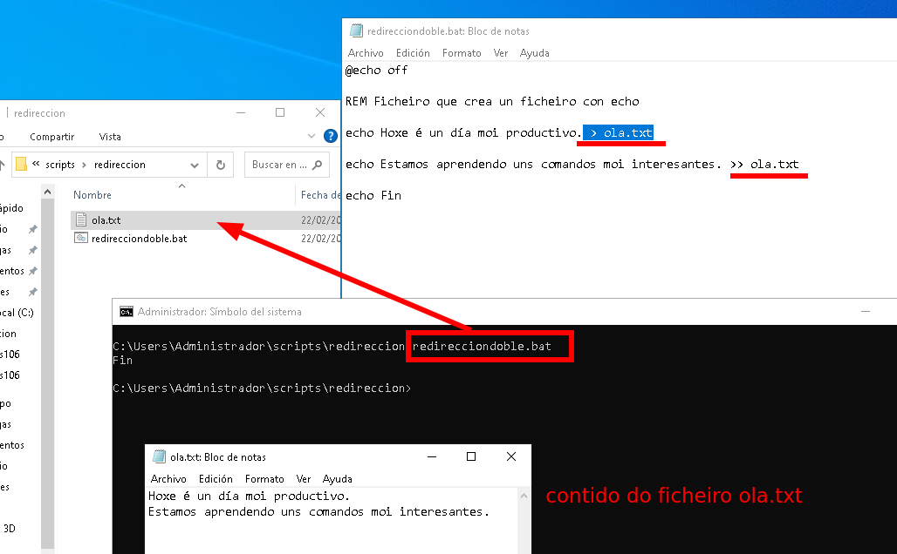
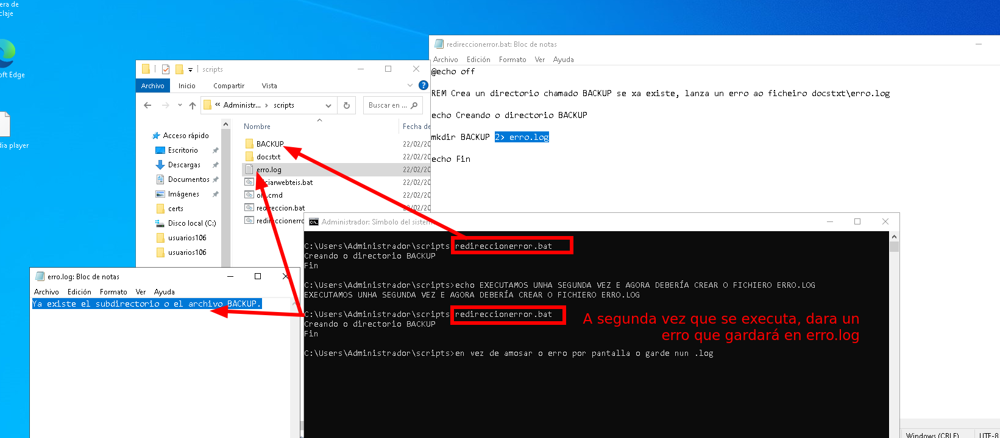
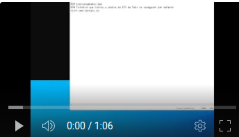

## Ola Mundo en Batch

Un script simple é:

```bat
@echo off
echo Ola Mundo
pause
exit
```
Gardamos o ficheiro co nome **ola.cmd**

O que debe facer é imprimir un texto en pantalla e esperar a que premamos unha tecla.



**echo** amosa a frase que vai a continuación por pantalla.

**pause** pausa a execución ata que se prema unha tecla.

**exit** pecha a ventana de comandos.

> Como se ve a execución de comandos é secuencial.

### Saída por pantalla respetando os caracteres especiais españois

Para que na saída por pantalla, se respeten os caracteres especiais españois engadimos a seguinte liña

`chcp 65001 > nul`

que fai referencia a como codifica Windows o formato **UTF-8** que é **65001**.

```bat
@echo off

REM chcp permite poner la codificación de idioma para que coja bien los caracteres especiales.
chcp 65001 > nul

echo Hoxe é un día moi productivo

echo Fin
```
Pode verse nas imaxes, a saída sen poñer 'chcp 65001 > nul' e poñéndoo.



## Redireccións >, 2>

##### **>** redirecciona a saída do comando anterior a un ficheiro.
Se o ficheiro non existe créao e si existe machaca o contido anterior polo novo.

```bat
@echo off

REM Ficheiro que crea un ficheiro con echo

echo Ola que tal? > docstxt\ola.txt

echo Fin
```
Neste exemplo, redireccionada a frase "Ola que tal?" e crea un ficheiro chamado ola.txt



##### >> engade a saída do comando anterior ao ficheiro que se lle indique. 
Se o ficheiro non existe créao e si existe engade o contido ao final do ficheiro.

No seguinte exemplo, vése como na primeira liña, machaca o ficheiro ola.txt anterior.

E no segundo echo, engade a saída do echo ao final do ficheiro.

```bat
@echo off

REM Ficheiro que crea un ficheiro con echo

echo Hoxe é un día moi productivo. > docstxt\ola.txt

echo Estamos aprendendo uns comandos moi interesantes. >> docstxt\ola.txt

echo Fin
```
Vídeo explicativo premendo sobre a imaxe
[](https://youtu.be/9hMyFu9z28s)


##### **2>** redirecciona o erro

No seguinte script crea un directorio. O que pasa que a segunda vez que o crea dará un erro, que en vez de amosarse por pantalla se garda no ficheiro **erro.log**.
```bat
@echo off

REM Crea un directorio chamado BACKUP se xa existe, lanza un erro ao ficheiro docstxt\erro.log

echo Creando o directorio BACKUP

mkdir BACKUP 2> erro.log

echo Fin

```
**mkdir** crea o directorio.

**2>** redirecciona a saída a o ficheiro que se indica erro.log.


---
Vídeo explicativo:
[](https://youtu.be/THKr8nK-aW8)


