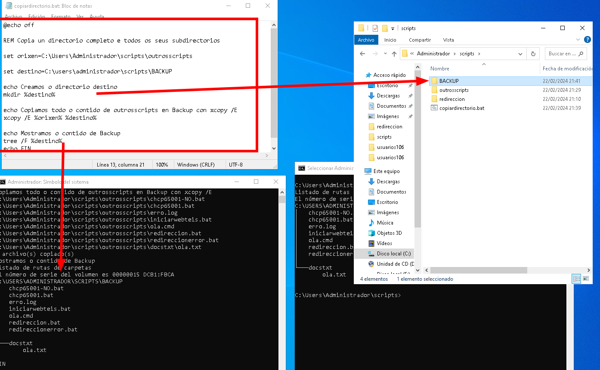
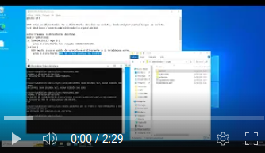
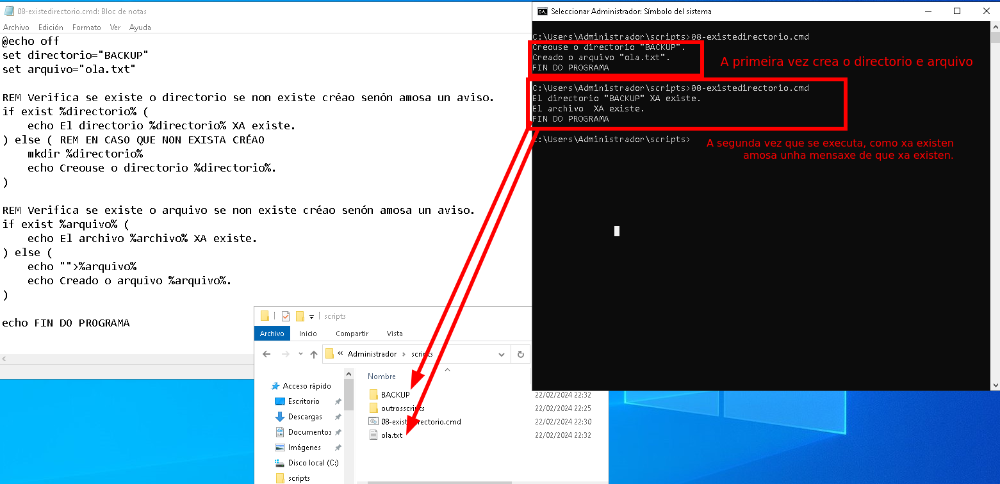

## Variables

Para definir variables empregamos o comando **set** 
Logo para chamalas dentro do script empréganse os símbolos de **%%**, de forma **%nomevariable%**.

```bat
@echo off

REM Copia un directorio completo e todos os seus subdirectorios

set orixen=C:\Users\Administrador\scripts\outrosscripts

set destino=C:\users\administrador\scripts\BACKUP

echo Creamos o directorio destino
mkdir %destino%

echo Copiamos todo o contido de outrosscripts en Backup con xcopy /E
xcopy /E %orixen% %destino%

echo Mostramos o contido de Backup
tree /F %destino%
echo FIN
```
Neste script, defínense dúas variables:

`set orixen= ruta`

`set destino= ruta`

Logo para chamalas dentro do script emprégase `%orixen%` `%destino%`.

O que fai o script, é crear a carpeta de destino empregando unha *ruta absoluta*.
`mkdir %destino%`

Facer unha copia completa do directorio "outrosscripts" áo directorio "BACKUP" recén creado.

> **/E** emprégase /E porque  Copia directorios e subdirectorios, incluíndo os que están vacíos.

`xcopy /E %orixen% %destino%`

E finalmente para comprobar que se copiou todo, amósase a árbore do subdirectorio BACKUP.

`tree /F %destino%`

Vídeo explicativo co proceso: ***preme no vídeo***
[](https://youtu.be/gubSSpOnmmI)

## Variable %ERRORLEVEL% e estrutura condicional IF-ELSE

**%ERRORLEVEL%** O valor de %errorlevel% é un número enteiro que indica se o comando anterior executouse correctamente ou se ocorreu algún erro.

+ Se %errorlevel% é **igual a 0**: entón o comando rematou **CORRECTAMENTE**
+ Se %errorlevel% é **distinto de 0**: entón **prodúxose un ERRO**

```bat
@echo off

REM Crea un directorio. Se o directorio destino xa existe, indicará por pantalla que xa existe.
set destino=C:\users\administrador\scripts\BACKUP

mkdir %destino% 2> nul
if %ERRORLEVEL% equ 0 (
    echo O directorio foi creado CORRECTAMENTE.
) else (
   REM neste caso o saída de errorleve é diferente a 1. Prodúxose erro.
    echo O directorio NON SE creou porque XA EXISTE.

)

echo FIN
```
+ **%errorlevel%% equ 0** comproba se a saída é **igual** a 0, e polo tanto EXITOSA.
+ **%errorlevel% neq 0%%** comproba se %errorlevel% é **distinto** de 0.

O que fai este script, é tentar crear a carpeta BACKUP, na ruta especificada va variable *%destino%*. No caso de que se produza un erro, non se amosará por pantalla porque o redirixe con **2>** ao lixo.

Logo coa estrutura condicional **IF-ELSE**, comproba se a saísa foi exitosa, é dicir, se **%errorlevel%% equ 0** é igual a 0, entón indica por pantalla que *"O directorio foi creado CORRECTAMENTE"*, en caso de qeu **%errorlevel%% sexa distinto de 0** entra pola rama do **else** e indica que *"O directorio xa existe"*.

Vídeo explicativo do proceso de execución deste script:

[](https://youtu.be/XtPuwor_g2A)

## Comprobar si existe un directorio ou un ficheiro -- IF EXIST

Para comprobar si existe un directorio ou un arquivo empregamos a expresión **if exist**

Se queremos comprobar que NON EXISTE poríamos **if not exist**

```bat
@echo off
set directorio=BACKUP  
set arquivo=ola.txt

REM Verifica se existe o directorio
if exist "%directorio%" (
    echo El directorio %directorio% XA existe.
) else (
    mkdir %directorio%
    echo Creouse o directorio %directorio%.
)

REM Verifica se existe o arquivo
if exist "%archivo%" (
    echo El archivo %archivo% XA existe.
) else (
    echo "">%arquivo%
    echo Creado o arquivo %arquivo%.
)

echo FIN DO PROGRAMA
```
No seguinte vídeo pode verse a execución deste script:
[](https://youtu.be/hNVExx3zI_M)
---
# Exercicios

Entra na carpeta home do teu usuario. (c:\users\nomedoteuusuario)

### Exercicio 1

Facer un script que defina as variables:
+ nome: que conteña o teu nome completo 
+ apelidos: que conteña os teus apelidos 

Debe amosar por pantalla o valor das variables, é dicir o teu nome e apelidos, xunto coa data nunha frase como a que se amosa no exemplo de saída:

EXEMPLO DE SAÍDA:
```
C:\Users\Administrador\scripts>exercicio1.bat
Benvida á clase de hoxe 22/02/2024 : Cristina Puga Barreiros
```


### Exercicio 2

Fai un script que cree unha carpeta que se chama BACKUPAPUNTES. Debe de comprobar, se xa existe, debe amosar unha mensaxe que poña que "O directorio BACKUPAPUNTES XA EXISTE" e senón existe debe creala e indicar por pantalla "Creado o directorio BACKUPAPUNTES"

### Exercicio 3

1) Descarga do libro documentación esta páxina en formato PDF e gárdaa en DIURNO/COMPARTIDO-VIRTUAL/Apuntes.
2) Comparte esta carpeta coa máquina virtual de Windows que estás a emprega, e que se monte co nome apuntes.

Crea un script que faga unha copia de todo o contido da carpeta compartida coa máquina á carpeta c:\users\<nomedoteusuario>\BACKUPAPUNTES.

Para facelo debes de definir as variables orixen e destino.

+ Debes comprobar se existe o **destino**, se non existe debes crealo.
+ Debes comprobar se existe o **orixen**, se non existe debes de sacar unha mensaxe que diga: *" NON EXISTE O ORIXEN NON SE PODE COPIAR."* Debe de solicitar premer nun botón e saír do programa con (exit).

Captura á saída da execución do comando. Se da erro, debe crear un ficheiro log, chamado **"backupapuntes.log"**.


### Exercicio 4

Fai un script que se chame instalacionchoco.

Debe de instalar con Chocolatey o FIREFOX. 
Se a instalación remata de forma exitosa, debe amosar o aviso "INSTALOUSE CORRECTAMENTE FIREFOX".
No caso de que se produza un erro, debe de aparecer soamente por pantalla " A INSTALACIÓN NON SE PUIDO REALIZAR".

Se se produxo un erro, debe de reflexalo no ficheiro **chocoerror.log**.


