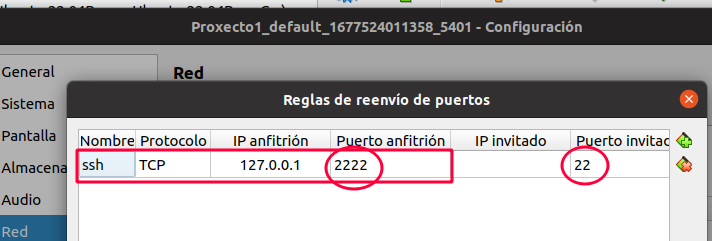
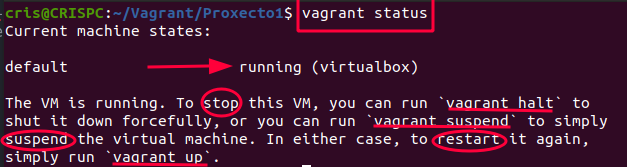
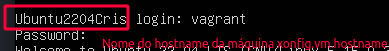

# Introdución a vagrant

## Instalación


Accede á paxina de documentación do proxecto (https://developer.hashicorp.com/vagrant/downloads) e crea un titorial básico de como instalaches vagrant no teu sistema operativo.
***

## Primeiro proxecto
Crea un directorio ***Vagrant*** dentro do cartafol do teu usuario, ou se estás na aula dentro de **/media/DIURNO/Vagrant**

1. Creamos dentro a carpeta ***Proxecto1***.  
```bash
mkdir Vagrant/Proxecto1
```
1. Abrimos a terminal de comandos dentro de Vagrant/Proxecto1 e escribimos ***vagrant init***:
```bash
vagrant init --minimal
```
1. Vemos que dentro da carpeta do proxecto nos aparece un ficheiro chamado **Vagrantfile**

1. Se o abrimos ten a estrutura do ficheiro de configuración de Vagrant.   
```ruby
# -*- mode: ruby -*-
# vi: set ft=ruby :
Vagrant.configure("2") do |config|
  config.vm.box = "base"
end
```
> config.vm.box = 'nomebox ' indica o nome do Box que queremos cargar.
1. Imos configurar o Box, e cargar o sistema operativo Ubuntu Server 22.04, que imos descargar de: https://app.vagrantup.com/. Editamos o VagrantFile e poñemos o seguinte, fíxate que toda a configuración se mete dentro de **Vagrant.configure("2") do |config|** e a palabra **end**:
~~~ruby
Vagrant.configure("2") do |config|
  config.vm.box = "techchad2022/ubuntu2204"
end
~~~
1. Hai que validar o ficheiro de configuración que acabamos de crear, para elo empregamos ***vagrant validate***
~~~bash
cris@CRISPC:~/Vagrant/Proxecto1$ vagrant validate
Vagrantfile validated successfully.
~~~
1. Se está ben validado, agora iniciamos a máquina, como non temos o box en local, descargarao do repositorio de vagrant. ***vagrant up***
~~~bash
cris@CRISPC:~/Vagrant/Proxecto1$ vagrant up
~~~

~~~
Bringing machine 'default' up with 'virtualbox' provider...
==> default: Box 'techchad2022/ubuntu2204' could not be found. Attempting to find and install...
    default: Box Provider: virtualbox
    default: Box Version: >= 0
==> default: Loading metadata for box 'techchad2022/ubuntu2204'
    default: URL: https://vagrantcloud.com/techchad2022/ubuntu2204
==> default: Adding box 'techchad2022/ubuntu2204' (v0.2) for provider: virtualbox
    default: Downloading: https://vagrantcloud.com/techchad2022/boxes/ubuntu2204/versions/0.2/providers/virtualbox.box
    default: Calculating and comparing box checksum...
==> default: Successfully added box 'techchad2022/ubuntu2204' (v0.2) for 'virtualbox'!
==> default: Importing base box 'techchad2022/ubuntu2204'...
==> default: Generating MAC address for NAT networking...
==> default: Checking if box 'techchad2022/ubuntu2204' version '0.2' is up to date...
==> default: Setting the name of the VM: Proxecto1_default_1677524011358_5401
==> default: Clearing any previously set network interfaces...
==> default: Preparing network interfaces based on configuration...
    default: Adapter 1: nat
==> default: Forwarding ports...
    default: 22 (guest) => 2222 (host) (adapter 1)
==> default: Running 'pre-boot' VM customizations...
==> default: Booting VM...
==> default: Waiting for machine to boot. This may take a few minutes...
    default: SSH address: 127.0.0.1:2222
    default: SSH username: vagrant
    default: SSH auth method: private key
    default:
    default: Vagrant insecure key detected. Vagrant will automatically replace
    default: this with a newly generated keypair for better security.
    default:
    default: Inserting generated public key within guest...
    default: Removing insecure key from the guest if it's present...
    default: Key inserted! Disconnecting and reconnecting using new SSH key...
==> default: Machine booted and ready!
==> default: Checking for guest additions in VM...
    default: The guest additions on this VM do not match the installed version of
    default: VirtualBox! In most cases this is fine, but in rare cases it can
    default: prevent things such as shared folders from working properly. If you see
    default: shared folder errors, please make sure the guest additions within the
    default: virtual machine match the version of VirtualBox you have installed on
    default: your host and reload your VM.
    default:
    default: Guest Additions Version: 6.0.0 r127566
    default: VirtualBox Version: 7.0
~~~
Vese en VirtualBox que se creou a máquina:


Na saída, cando chamamos a "vagrant initW, vemos:
- Que a primeira vez que se instancia a máquina, busca BOX no disco local, e ao non atopalo, descargao de Internet.
~~~bash
default: Box techchad2022/ubuntu2204 could not be found. Attempting to find and install...
~~~
- Por efecto, crea unha interface NAT en virtualbox
~~~
==> default: Generating MAC address for NAT networking...
~~~
- Que redirecciona o **porto 22** do equipo virtual, correspondente ao **SSH** ao porto **2222** do equipo real. Isto faise para permitir o acceso por ssh desde o equipo anfitrión, e tamén se pode ver o usuario que se emprega co ssh que é **vagrant** :
~~~
 default: 22 (guest) => 2222 (host) (adapter 1)
 ...
 default: SSH username: vagrant
 default: SSH auth method: private key
 ~~~
 E pode verse na máquina virtual a configuración:
 
- Configúrase o acceso por ssh á máquina virtual usando claves dixitais (sen contrasinal).
 - Finalmente indica que as Guest Additions non se corresponden coa versión de VirtualBox, así que deberíamos instalalar no servidor.
 No apartado [Instalar Guest Additions](#Instalar-Guest-Additions)    

- A máquina execútase en segundo plano, é dicir en modo headless.

### Comandos para Parar, arrancar e destruír a máquina

```vagrant status```: Para ver o estado da máquina.




 ```vagrant halt``` : Parar a máquina virtual

 - Este comando apaga a  máquina virtual.


 ```vagrant up```: Arrancar de novo a máquina virtual

 - Este comando arranca de novo a máquina virtual que xa se iniciou, a lo menos unha vez con vagrant init.


 ```vagrant destroy -f```:  Destruir a *máquina virtual* e a carpeta *.vagrant*.

 - Este comando destrúe a máquina virtual e directorio .vagrant que se crea dentro da carpeta do proxecto.
 - Ademáis, instálase un directorio, xeralmente dentro da carpeta do usuario **/home/usuario/.vagrant.d**, o directorio oculto **.vagrant.d** onde se atopan as imaxes dos boxes, e que é convinte borrar se non necesitamos xa a máquina.

```vagrant ssh``` : Permite conectarse por **ssh** coa máquina.

Tamén podería empregarse ```ssh vagrant@127.0.0.1 -p 2222```


### Instalar Guest Additions,no caso de que difiran da versión de VirtualBox instalada no equipo local
- Executamos a máquina desde virtualBox.
- Insertamos o CD das Guest Additions.
- Antes de nada actualizamos os repositorios do SO
```bash
sudo apt-get update
```

- Montamos o cd e executamos o instalador das Guest Additions "VBoxLinuxAdditions.run"
``` bash
mkdir /home/vagrant/cd
sudo mount -t iso9660 /dev/sr0 /home/vagrant/cd
cd /home/vagrant/cd
sudo ./VBoxLinuxAdditions.run
```
Si durante a instlación nos pide instalar algún paquete para poder finalizar a instalación das Guest Additions, facémolo.

### Conectarse por ssh coa máquina

1. Levantamos a máquina virtual, sempre dentro do entorno virtual que queramos para o proxecto, neste caso /media/DIURNO/vagrant/proxecto1 ```vagrant up```
1. Executamos dentro do entorno virtual, do directorio do noso **Proxecto1** ```vagrant ssh```
  
Vemos que xa estamos dentro da máquina que acabamos de crear, e que o noso usuario por defecto é vagrant.
1. Podemos consultar o sistema operativo que está correndo empregando o comando ```lsb_release -a```.
  

### Carpeta creada dentro da carpeta do proxecto

Se miramos dentro da carpeta do proxecto, existe unha carpeta ***.vagrant*** onde se van metendo as configuracións da máquina.

  

### Destruír e borrar unha máquina que xa non necesitamos

1. Acceder dentro da carpeta do proxecto, neste caso Proxecto1.
1. Facer ```vagrant destroy -f```
  Esto destrúe a *máquina virtual* e a carpeta *.vagrant*.
1. Acceder á carpeta oculta **.vagrant.d** e eliminar o **box** da máquina que xa non queremos.
Neste caso, imos á /home/nomeusuario/.vagrant.d
  
1. Accedemos á carpeta **boxes**
  
Vemos que está o box da máquina que acabamos de crear.
Miramos canto ocupa, e vemos que ocupa 1.7GB:
  
1. Por último borramos o box:
```rm techchad2022-VAGRANTSLASH-ubuntu2204/```

### Cambiar parámetros de configuración no Vagrantfile.
Para cambiar determinados parámetros de configuración no vagrantfile, facemos:
~~~ruby
Vagrant.configure("2") do |config|
  config.vm.box = "techchad2022/ubuntu2204"
  config.vm.hostname='Ubuntu2204Cris'
  config.vm.provider "virtualbox" do |vb|
    vb.memory = "2048"
    vb.cpus = 2
    vb.name='Ubuntu22.04-CrisPuga'
    vb.gui = true
    end
  config.vm.synced_folder ".data", "/home/vagrant/data"
end
~~~
- Nome do **hostname** cando a máquina se está a executar.
  
- Crear unha **carpeta compartida** entre a máquina Host e a máquina virtual Vagrant, engadimos a seguinte liña no ficheiro vagrantfile.
 ```config.vm.synced_folder "./carpetadentroEntornoProxecto", "/home/vagrant/micarpeta"```
Para facer isto, dentro da máquina host, debemos crear unha carpeta dentro do Proxecto.
```mkdir ./data```
E si levantamos a máquina, na seguinte imaxe podemos ver, cómo o que se crea en /home/vagrant/micarpeta, se ve na carpeta do proxecto .data/ e viceversa.
  

- Características da máquina en VirtualBox **config.vm.provider "virtualbox" do |vb|** dentro deste parámetro e ata que aparece **end**
  - Memoria da máquina, **vb.memory**, neste caso é 2048.
  - Número de procesadores **vb.cpus**, neste caso 2.
  - Nome da máquina virtual no panel de VirtualBox **vb.name**, neste caso Ubuntu22.04-CrisPuga
  - Que a máquina, non se execute en segundo plano, senón que arranque a interface gráfica ao levantala **vb.gui = true**.
  Pódense ver estes parámetros ao levantar a máquina con ```vagrant up```
    

***
## EXERCICIOS

### Exercicio 1
Copia o **vagrantfile** do proxecto1 a outra carpeta **Proxecto2**, que será un entorno virtual para Vagrant, e cambialle as seguintes configuracións:
- Memoria 2000 MB
- Cpus: 2
- Que lance o entorno gráfico GUI ao levantar a máquina.
- Que comparta unha carpeta **Proxecto2/.datos/** coa máquina virtual /home/vagrant/datos

### Exercicio 2
Borra as máquinas virtuais creadas no Proxecto1 coas opcións de vagrant correctas, eliminando os boxes.

### Exercicio 3
Crea un novo proxecto, chamado **Proxecto3**, e  modifica o Vagrantfile para facer que a distro
base sexa **centos-7.6**:
- o hostname da máquina debe ser "Centros76TeuNome"
- Memoria 2000 MB
- Cpus: 2
- Nome da máquina no panel de VirtualBox: Centos7.6-Centros76TeuNome
- Comparta unha carpeta que se chame no host .datoscompartidos e na máquina virtual /home/vagrant/datoscompartidos.

***
#### Autora
Cristina Puga Barreiros
[@crispuga](https://twitter.com/crispuga)

<a rel="license" href="http://creativecommons.org/licenses/by-sa/4.0/"></a><br />Este obra está bajo una <a rel="license" href="http://creativecommons.org/licenses/by-sa/4.0/">licencia de Creative Commons Reconocimiento-CompartirIgual 4.0 Internacional</a>.
