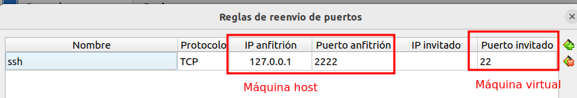
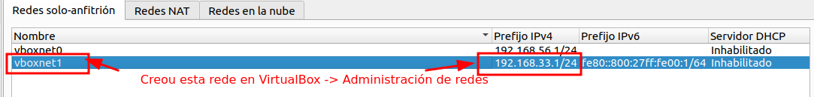
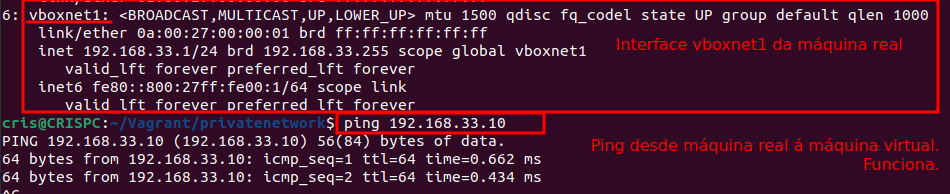

### Configuración da rede por defecto NAT

Cando se crea unha máquina con Vagrant, creáse por defecto **unha interface de rede en modo NAT**.

Ademais a esta interface de rede, se lle configura unha redirección de portos automáticamente, o **porto ssh** corre na **máquina virtual** no porto **22**, e redireccionase á **máquina host** ao porto **2222**.

Gracias a esto, podémonos conectar á máquina virtual desde a real coa cadena:

`ssh vagrant@127.0.0.1 -p 2222`

### Configuración de Rede Privada - Host Only - Ip Fixa

Para configurar unha rede de tipo **Host Only** é dicir entre o host e o equipo virtual soamente, debemos engadir unha liña ao Vagrantfile así:

`config.vm.network "private_network", ip: "192.168.33.10"`

+ **ip** podemos indicarlle unha IP concreta, e creará na máquina virtual unha re de Host Only con ese rango de ips. Neste caso crea a subrede: **192.168.33.0**

+ **Máquina host**: Deste xeito á máquina host ou real, terá a IP **192.168.33.1** como se ve na imaxe.
+ **Máquina virtual**: terá a ip **192.168.33.10**

Así si facemos un ping desde a máquina real á virtual responde:

--- ** Ficheiro Vagrantfile con private_network** -- [Vagrantfile](./scriptsVagranfiles/privatenetworkfija/Vagrantfile)

### Configuración de Rede Privada - Host Only - Ip DHCP

Se queremos configurar unha rede privada, que se corresponde co modo de rede **Host Only** pero que colla a dirección por DHCP, faremos:

`config.vm.network "private_network", type: "dhcp"`

--- Mais información: https://www.busindre.com/guia_rapida_de_vagrant
