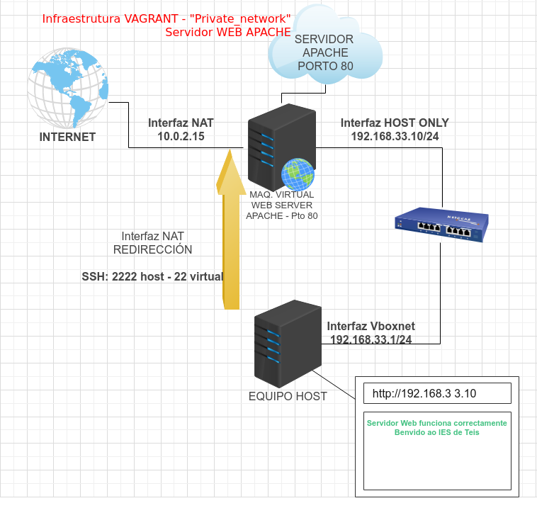

### Configuración da rede por defecto NAT

Cando se crea unha máquina con Vagrant, creáse por defecto **unha interface de rede en modo NAT**.

Ademais a esta interface de rede, se lle configura unha redirección de portos automáticamente, o **porto ssh** corre na **máquina virtual** no porto **22**, e redireccionase á **máquina host** ao porto **2222**.

Gracias a esto, podémonos conectar á máquina virtual desde a real coa cadena:

`ssh vagrant@127.0.0.1 -p 2222`

### Configuración de Rede Privada - Host Only - Ip Fixa

Para configurar unha rede de tipo **Host Only** é dicir entre o host e o equipo virtual soamente, debemos engadir unha liña ao Vagrantfile así:

`config.vm.network "private_network", ip: "192.168.33.10"`

+ **ip** podemos indicarlle unha IP concreta, e creará na máquina virtual unha re de Host Only con ese rango de ips. Neste caso crea a subrede: **192.168.33.0**

+ **Máquina host**: Deste xeito á máquina host ou real, terá a IP **192.168.33.1** como se ve na imaxe.
+ **Máquina virtual**: terá a ip **192.168.33.10**

Así si facemos un ping desde a máquina real á virtual responde:

--- ** Ficheiro Vagrantfile con private_network** -- [Vagrantfile](./scriptsVagranfiles/privatenetworkfija/Vagrantfile)
+ Crear un directorio **web** dentro da carpeta virtual onde se execute Vagranfile.
Esta máquina instala un servidor Apache tamén, ao que se pode acceder desde a IP do equipo virtual.

Un exemplo de esquema de rede do suposto é:

---
### Exercicios

1) Crea unha carpeta dentro da carpeta ~/vagrant, chamado "privatenetwork". Copia ahí o Vagrantfile onde se crea a rede privada.

1) Na **MÁQUINA HOST**, realiza:
    + `ip a` comproba as interfaces de rede que ten a túa máquina, e comproba, se hai algunha que pertenza á rede 192.168.33.0/24.
    + Fai un ping á máquina que está correndo que debería ter a ip 192.168.33.10. E indica se responde ou non. 
    
    Captura unha pantalla destas dúas evidencias.

1) Vai ao navegador Web e pon a ip 192.168.33.10 nel. Funciona o servidor Web?

1) Na **pantalla de configuración de VIRTUALBOX** comproba:
    + As Interfaces de rede coas que conta a máquina e o tipo que teñen. Indícao ou captura unha pantalla.
    + Vai a interface con Rede NAT e comproba en REENVÍO DE PUERTOS, que portos ten redireccionados.
    + Vai ao menú de VirtualBox ***Archivo-> Herramientas -> Administrador de red*** e comproba na pestaña *Redes solo-anfitrión* se aparece a interface de rede da máquina host que está na rede 192.168.30.0.

1) Accede á **MÁQUINA VIRTUAL**, por ssh ou desde a interface gráfica de VirtualBox.
    + Indica o nome do host. Executando `$hostname` na liña de comandos.
    + Executa `$lsb_release -a` e indica o sistema operativo do que se trata.
    + Executa `$ip a` e indica:
        + O número de interfaces de rede que ten
        + O nome de cada interface e que ip teñen.
        + Cal destas interfaces é a que pertence á rede 192.168.33.0 ?
        + Fai un ping á ip da máquina HOST `$ping 192.168.33.1` responde?
1) Fai un debuxo a man ou nun programa de debuxo de redes (EdrawMax, yEd Graph Editor, ou outro que queiras) e debuxa a situación do teu HOST e a túa máquina VIRTUAL con todas as súas interfaces de rede.

