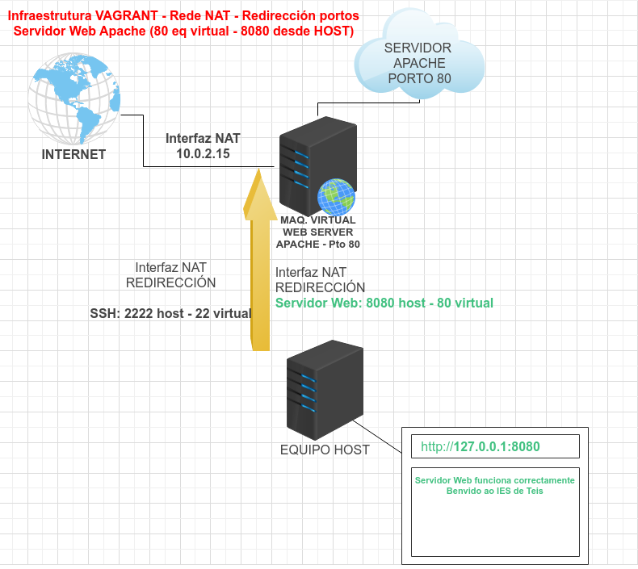

### Configuración da rede por defecto NAT

Cando se crea unha máquina con Vagrant, creáse por defecto **unha interface de rede en modo NAT**.

Ademais a esta interface de rede, se lle configura unha redirección de portos automáticamente, o **porto ssh** corre na **máquina virtual** no porto **22**, e redireccionase á **máquina host** ao porto **2222**.

Gracias a esto, podémonos conectar á máquina virtual desde a real coa cadena:

`ssh vagrant@127.0.0.1 -p 2222`

## Acceder ao servidor APACHE con REDIRECCIÓN

Outra forma de acceder ao servidor Apache sen configurar ningunha interface máis sería a través da **redirección de portos na interface NAT**.

**`config.vm.network "forwarded_port", guest: "80", host: "8080"`**

Deste xeito cando se inicia a máquina, se accedemos á parte de redirección de portos da interface NAT, que é a única que ten o equipo:

A infraestrutura de rede sería algo así:

Como se ve na imaxe, accederíamos ao servidor Web, desde o navegador, polo protocolo **http** á dirección localhost **127.0.0.1:8080**.

> DESCARGA FICHEROS
>
> [Vagrantfile de NAT con redirección de porto HTTP](./scriptsVagranfiles/natRedireccionhttp/Vagrantfile)
