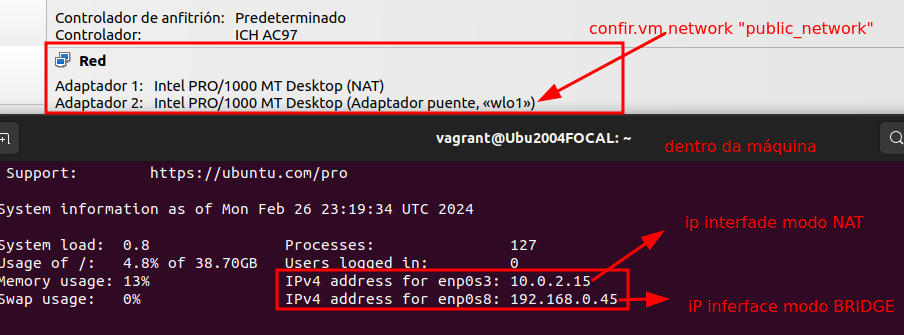
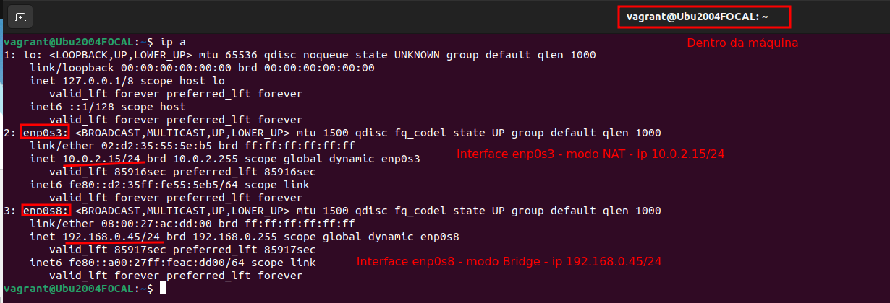

### Configuración de Rede PÚBLICA- Modo de rede Puente/Bridge

Para configurar unha rede de tipo **Puente ou Bridge** é dicir que a máquina virtual pase a formar parte da rede física da máquina Host:

##### public_network con ip por DHCP
**`config.vm.network "public_network"`**

Se na nosa rede local hai un servidor DHCP, este servidor asígnalle unha IP.

No meu caso vese que ten:
+ Interface en **modo NAT**: que ao iniciar a máquina colle ip **10.0.2.15**
+ Interface en **modo BRIDGE**: á que lle asigna unha ip o DHCP, neste caso de exemplo, **192.168.0.45**

Se nos conectamos por ssh á máquina virtual, ou mediante o modo gráfico de VirtualBox, e facemos un `ip a`, podemos ver:

##### public_network ip FIXA

Engadiríamos no Vagrantfile unha liña como a que sigue.

**`config.vm.network "public_network", ip: "192.168.0.66"`**
> OLLO!! Debemos asignar unha ip que pertenza á rede do host. No meu caso debe ser dentro da rede 192.168.0.0/24.

Eu asigneille a IP: **192.168.0.66** que pertence á subrede do host, para que poidan ter conectividade.

Como se pode ver a continuación, ao iniciar á máquina asigna:

+ modo NAT - 10.0.2.15
+ modo Bridge - a IP que lle indicamos no Vagrantfile, neste caso 192.168.0.66.

Logo vése na imaxe da esquerda, que ao facer ping desde o Host ao equipo virtual, hai conectividade.

---
### Exercicios

1) Crea unha carpeta dentro da carpeta ~/vagrant, chamado "privatenetwork". Copia ahí o Vagrantfile onde se crea a rede privada.

1) Na **MÁQUINA HOST**, realiza:
    + `ip a` comproba as interfaces de rede que ten a túa máquina, e comproba, se hai algunha que pertenza á rede 192.168.33.0/24.
    + Fai un ping á máquina que está correndo que debería ter a ip 192.168.33.10. E indica se responde ou non. 
    
    Captura unha pantalla destas dúas evidencias.

1) Na **pantalla de configuración de VIRTUALBOX** comproba:
    + As Interfaces de rede coas que conta a máquina e o tipo que teñen. Indícao ou captura unha pantalla.
    + Vai a interface con Rede NAT e comproba en REENVÍO DE PUERTOS, que portos ten redireccionados.
    + Vai ao menú de VirtualBox ***Archivo-> Herramientas -> Administrador de red*** e comproba na pestaña *Redes solo-anfitrión* se aparece a interface de rede da máquina host que está na rede 192.168.30.0.

1) Accede á **MÁQUINA VIRTUAL**, por ssh ou desde a interface gráfica de VirtualBox.
    + Indica o nome do host. Executando `$hostname` na liña de comandos.
    + Executa `$lsb_release -a` e indica o sistema operativo do que se trata.
    + Executa `$ip a` e indica:
        + O número de interfaces de rede que ten
        + O nome de cada interface e que ip teñen.
        + Cal destas interfaces é a que pertence á rede 192.168.33.0 ?
        + Fai un ping á ip da máquina HOST `$ping 192.168.33.1` responde?
1) Fai un debuxo a man ou nun programa de debuxo de redes (EdrawMax, yEd Graph Editor, ou outro que queiras) e debuxa a situación do teu HOST e a túa máquina VIRTUAL con todas as súas interfaces de rede.

--- Mais información: https://www.busindre.com/guia_rapida_de_vagrant
