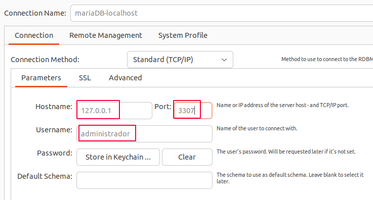
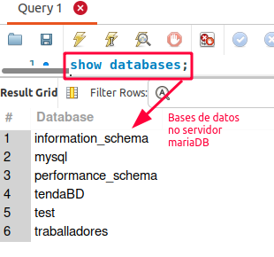
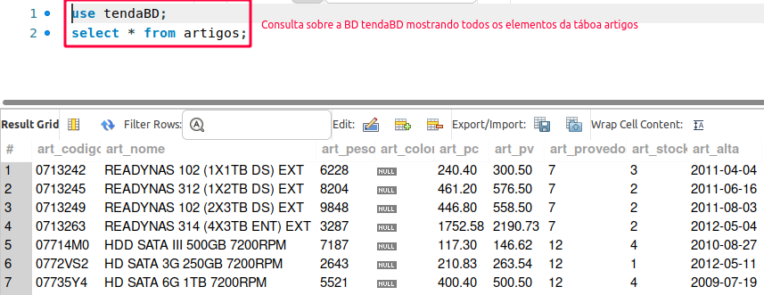

# Vagrant

## Proxecto para crear un servidor mariaDB en Centos 7.6

Crea un novo proxecto, chamado **Proxecto3mariadb**, e  modifica o Vagrantfile para facer que a distro base sexa **centos-7.6**:
- o hostname da máquina debe ser "Centros76TeuNome"
- Memoria 2000 MB
- Cpus: 2
- Nome da máquina no panel de VirtualBox: Centos7.6-Centros76TeuNome
- Comparta unha carpeta que se chame no host "scripts" e na máquina virtual "/scritps".

Para facer o proxecto, empregaremos varios scripts de SQL:
- **accesosusuarios.sql** : Onde crearemos os usuarios que poidan acceder desde calquera PC, independientemente da IP que teñan.
- **tendaBD.sql, traballadores.sql**: bases de datos empregada pola profesora do módulo de BD para traballar.

###### Ficheiro VagrantFile no Proxecto3mariadb
~~~ruby
Vagrant.configure("2") do |config|
  config.vm.box = "ubuntu/focal64"
  config.vm.hostname="mariadb-server-56-242-3308"
  config.vm.network "private_network", ip: "192.168.56.242"
  config.vm.network "forwarded_port", guest: 3306, host:3308
  config.vm.provider "virtualbox" do |vb|
     vb.name="mariadbServer"
     # vb.gui= true
     vb.memory = "1024"
     vb.cpus = 2
     vb.linked_clone = true
  end
  config.vm.synced_folder "./scripts", "/scripts"
  config.vm.provision "shell", inline: <<-SHELL

    echo "Actualizando"
  	apt update -y
  	echo "Asignando chave a BD"
  	sudo echo "mariadb-server mariadb-server/root_password password renaido" | debconf-set-selections
  	sudo echo "mariadb-server mariadb-server/root_password_again password renaido" | debconf-set-selections

  	echo "Instalar mariadb"
  	apt install mariadb-server -y
  	echo "-----------------"

  	echo "Permitir acceso desde calquera equipo a mariaDB"

  	echo "Editando /etc/mysql/my.cnf "
  	echo "[mysqld]" >> /etc/mysql/my.cnf
  	echo "character_set_server=utf8mb4" >> /etc/mysql/my.cnf
  	echo "collation_server=utf8mb4_unicode_ci" >> /etc/mysql/my.cnf
  	echo "bind-address = 0.0.0.0" >> /etc/mysql/my.cnf

  	sudo systemctl start mariadb
  	sudo systemctl enable mariadb

  	echo " Dandolle acceso usuarsio DB "
  	mysql -uroot -prenaido -h localhost -e "CREATE USER 'administrador'@'%' IDENTIFIED BY 'renaido'";
  	mysql -uroot -prenaido -h localhost -e "GRANT ALL ON *.* TO 'administrador'@'%'";
  	mysql -uroot -prenaido -h localhost -e "flush privileges";

  	echo "Crear bd traballadores "
  	mysql -uroot -prenaido -h localhost < /scripts/traballadores.sql
  	echo "Crear bd tendaBD "
  	mysql -uroot -prenaido -h localhost < /scripts/tendaBD.sql


  	sudo systemctl restart mariadb

  	echo "-------FIN----------"
  SHELL

end
~~~
- Ao aprovisionar a máquina realízase:
  - Actualización dos repositorios ```apt update -y```, emprégase **-y** para que a instalación non sexa interactiva.
  - Configúrase respostas para a base de datos de debconf, de forma que cando se instale a apliación, vai coller as respostas que se introduxeron aquí ```debconf-set-selections```
  - Instálase a base de datos **mariadb-server** mediante ```apt install mariadb-server -y```, emprégase a opción -y, para que sexa NON interactiva a instalación.
  - Configúrase a base de datos, para que se poida acceder desde calquera IP, para o que hai que modificar o ficheiro ```/etc/mysql/my.cnf``` e engadirlle **bind = 0.0.0.0**. demais neste ficheiro debemos introducir o xogo de caracteres co que funcionará o xestor de base de datos, parámetros ```character_set_server=utf8mb4``` e ```collation_server=utf8mb4_unicode_ci``` por eso co comando **tee -a** que o que fai é engadir ao final dun ficheiro o que se lle pase no "echo"
  ~~~bash
  echo "[mysqld]" >> /etc/mysql/my.cnf
  echo "character_set_server=utf8mb4" >> /etc/mysql/my.cnf
  echo "collation_server=utf8mb4_unicode_ci" >> /etc/mysql/my.cnf
  echo "bind-address = 0.0.0.0" >> /etc/mysql/my.cnf
  ~~~
  - Estáblecese que se inicie o servizo **mariadb** cando se inicie o sistema, co comando ```sudo systemctl enable mariadb```
  - Iníciase no momento o servizo de mariaDB, co comando, ```sudo systemctl start mariadb```
  - Créase un usuario dentro da base de datos, que poida acceder desde calquera IP (**%**), creamos o usuario **administrador** coa contrasinal **renaido**. Será este o usuario que empregaremos para conectarnos desde o cliente de mysql.
  ###### accesosusuarios.sql: Script para crear o usuario ***root*** e ***userbd*** que poidan acceder desde calquera IP no Proxecto3mariadb

  ~~~bash
    mysql -uroot -prenaido -h localhost -e "CREATE USER 'administrador'@'%' IDENTIFIED BY 'renaido'";
    mysql -uroot -prenaido -h localhost -e "GRANT ALL ON *.* TO 'administrador'@'%'";
    mysql -uroot -prenaido -h localhost -e "flush privileges";

  ~~~
  - Para ter unhas bases de datos con exemplos, créanse as bases de datos, por exemplo, as ***traballadores.sql*** e ***tendaBD.sql*** (*creadas por Vanesa Resúa*) paśandolle por redirección o script de creación ao mysql: ``` mysql -uroot -prenaido -h localhost < /scripts/traballadores.sql```, e así coa outra base de datos de exemplo. Estes scripts léeos da carpeta compartida "synced_folder" creada no VagrantFile.

***
Executando este entorno virtual de Vagrant, teremos funcionando automáticamente:
1. Unha máquina virtual con MariaDB, e coas bases de datos xa creadas que lle pasamos no vagrantfile.
1. Poderemos acceder a ela desde o noso equipos host empregando o porto 3306.
1. Os usuarios para poder conectarse serán "userbd" con contrasinal "userbd" e "root" con contrasinal "renaido".

Por exemplo, se accedemos desde WorkBench:
1. Configuramos a conexión:

1. Vemos as bases de datos que hai.```show databases;``` E vemos a saída.

1. Seleccionamos unha base de datos e facemos unha consulta de proba.
~~~SQL
use tendaBD;
select * from artigos;
~~~
E vemos a saída.



***
#### Autora
Cristina Puga Barreiros
[@crispuga](https://twitter.com/crispuga)

<a rel="license" href="http://creativecommons.org/licenses/by-sa/4.0/"></a><br />Este obra está bajo una <a rel="license" href="http://creativecommons.org/licenses/by-sa/4.0/">licencia de Creative Commons Reconocimiento-CompartirIgual 4.0 Internacional</a>.
