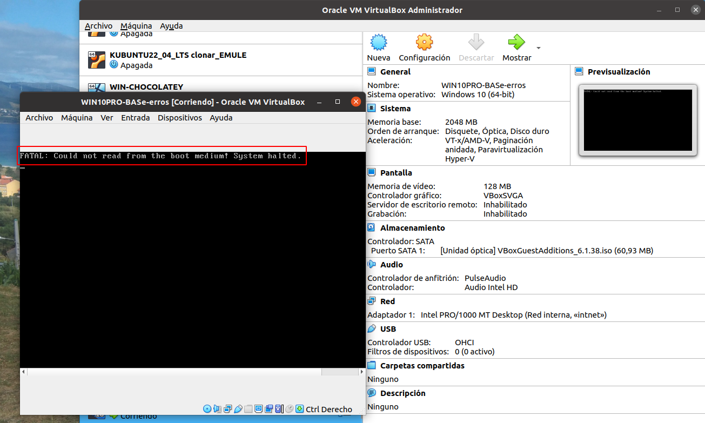
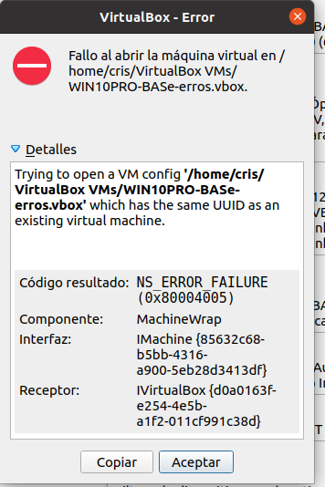
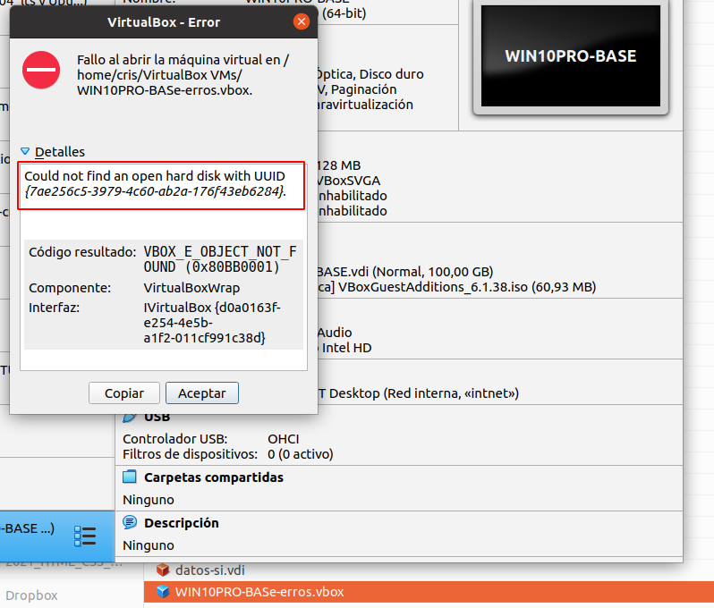
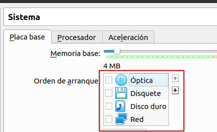
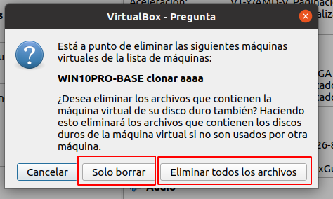

## Erros básicos en virtualización. Identifícaos
### Cuestión 1
Que cres que pode estar pasando nesta situación? Cando se inicia a máquina virtual e se amosa unha pantalla como a que sigue?

### Cuestión 2
Que cres que pode estar pasando nesta situación? Cando premo sobre o **ficheiro .vbox** dunha máquina virtual e sae e se amosa unha pantalla como a que sigue?

### Cuestión 3
Que cres que pode estar pasando nesta situación? Cando premo sobre o **ficheiro .vbox** dunha máquina virtual e sae e se amosa unha pantalla como a que sigue?

### Cuestión 4
Que significa o UUID dun disco, e como podo saber que UUID ten o disco da máquina que estou empregando.

### Cuestión 5
Se quero copiar un disco duro dunha máquina que xa teño, que debo facer?

- Ir ao explorador de Windows e copiar/pegar?
- Ir ao administrador de medios virtuais e facer algo alí?

Explica como o farías.

### Cuestión 6
Que ocorre ao iniciar á máquina, se teño configurada a orde de arranque da miña máquina virtual como se amosa na seguinte imaxe:

### Cuestión 7
Que diferencia hai, cando vou a borrar unha máquina virtual, se escollo a opcion SOLO BORRAR ou a opción ELIMINAR TODOS LOS ARCHIVOS.

###  
###  
###  
###  

*Documentación realizada por Cristina Puga Barreiros - 2023:* 
