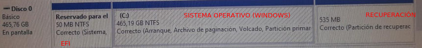

# Instalación arranque dual nun disco que contén Windows 10 Pro instalado en disco GPT

Nesta guía vaise instalar Ubuntu 22.04 nun disco en formato GPT que contén unha instalación de Windows 10 Pro, nun disco de capacidade 500GB.
### Punto de partida do disco, antes de instalar Linux

### Estado do modo da BIOS - UEFI
Na opción da BIOS desactivamos o CSM se existe ou poñemos modo UEFI.

## Instalación automática e por defecto de GNU/Linux Ubuntu 22.04

Se nestas condicións instalamos Ubuntu 22.04, o programa de instalación, debería detectar por defecto a instalación que temos de Windows 10, e propoñernos automáticamente si **queremos instalar Linux xunto a Windows** como se ve na imaxe.

+ Escollemos a instlación normal

+ Escollemos instalar **xunto a Boot Manager**

+ Preséntanos unha **PROPOSTA DE INSTALACIÓN**

Vemos que nesta proposta ofrece no **DISCO0** ou **sda**:
+ PARTICIÓN DE WINDOWS (**/dev/sda3**) de tamaño 257.3GB e formato NTFS que xa posúe
+ PARTICIÓN DE LINUX UBUNTU (**/dev/sda4**) de tamaño 242.7GB e formato ext4

Realmente o que está facendo é redimensionar a partición NTFS inicial que era de **465.19GB**

Premeríamos en **INSTALAR AHORA** e continuaría coa instalación normal.

