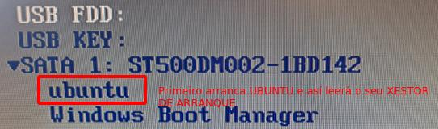
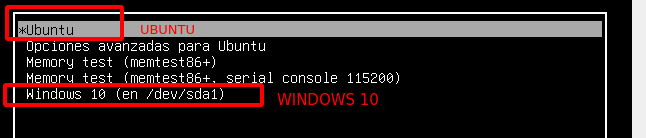
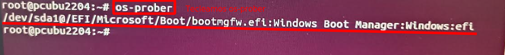
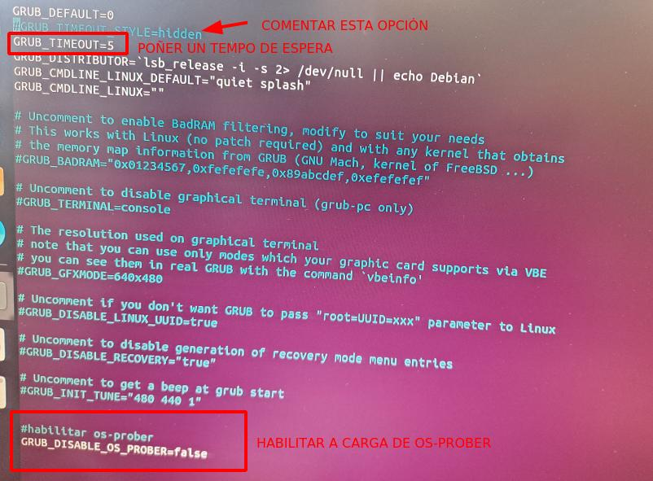

### Verificación configuración en caso de ERRO arranque dual GPT

Se facendo o que se indicaba en [páxina de "Arranque Dual Windows Linux en GPT"](../arranqueDualGPT/arranquedual.md) o sistema non inicia, imos comprobar os seguintes pasos:

### 1. O modo no Setup é UEFI.

Accedemos á BIOS do equipo e comprobamos que está configurada en modo UEFI. 
No caso de ter modo de compatibilidade CSM, comprobamos que éste está **deshabilitado**, 


ou ben, si está **habilitado** que estea en modo **UEFI ONLY**


### 2. O Secure Boot está deshabilitado

Co secure boot habilitado podemos ter problemas coas firmas dos sistemas operativos cos que traballamos, se non están firmados ou a súa firma non está rexistrada na CMOS, así que mellor o temos deshabilitado.


### 3. Na orden de arranque DA UEFI, ARRANCA UBUNTU PRIMEIRO
Na orden de arranqeu da BIOS, configuramos que arranque primeiro Ubuntu.


### 4. Debería salgar o GRUB ofrecendo o arranque de Linux e Windows.

Se a configuración se fixo ben. Os dous sistemas foron instalados coa BIOS en modo UEFI no período de instalación e se mantén o modo UEFI, debería de funcionar todo e aparecer o **xestor de arranque** de gnu/linux **GRUB**


### 5. Se neste paso non ofrece a posibilidade de arrancar WINDOWS.
Como no estado inicial do noso disco, temos un Windows Instalado. Debería o xestor de arranque de ubuntu ofrecernos iniciar cada un dos dous sistemas.

De non facelo imos facer comprobacións.

#### Comprobamos se está instalado OS-PROBER

Tecleamos na terminal do noso sistema linux o comando `os-prober`



Na execución deste comando, debería de aparecer o cargador EFI do Windows. O **Windows Boot Manager:efi**

>**!!! Impte !!!** *De non detectar o Windows Boot Manager, comprobar se realmente está configurado o modo UEFI na BIOS. E por suposto se existe información do sistema na partición de Windows.*

#### Actualizamos o Grub (update-grub)

Se o os-prober detectou o cargador de Windows, entón actualizamos o grub
```
sudo update-grub
```

Como se pode ver na imaxe, o **xestor de arranque, grub,** detectou o cargador do SO Windows **bootmgfw.efi**

Así que si reiniciamos, agora xa debería de aparecer o menú do grub do que se fala no punto 4.

##### En caso de que non apareza outra solución: editar /etc/default/grub

Un dos ficheiros que configura o xestor de arranqeu grub é o `/etc/default/grub` se o editamos con 
```console
sudo nano /etc/default/grub
```
E desactivamos as opcións:
```shell
GRUB_DEFAULT=0
#GRUB_TIMEOUT_STYLE=hidden     #COMENTAMOS ESTA LIÑA XA QUE O 
                               #INDICA É QUE NON SE AMOSE O MENÚ DE ARRANQUE
                                 
GRUB_TIMEOUT=10  #ASIGNAMOS AQUÍ 10 SEGUNDOS PARA ESCOLLER OPCIÓN
GRUB_DISTRIBUTOR=`lsb_release -i -s 2> /dev/null || echo Debian`
GRUB_CMDLINE_LINUX_DEFAULT="libata.noacpi=1"
GRUB_CMDLINE_LINUX=""

# Uncomment to enable BadRAM filtering, modify to suit your needs
# This works with Linux (no patch required) and with any kernel that obtains
# the memory map information from GRUB (GNU Mach, kernel of FreeBSD ...)
#GRUB_BADRAM="0x01234567,0xfefefefe,0x89abcdef,0xefefefef"

# Uncomment to disable graphical terminal (grub-pc only)
#GRUB_TERMINAL=console

# The resolution used on graphical terminal
# note that you can use only modes which your graphic card supports via VBE
# you can see them in real GRUB with the command `vbeinfo'
#GRUB_GFXMODE=640x480

# Uncomment if you don't want GRUB to pass "root=UUID=xxx" parameter to Linux
#GRUB_DISABLE_LINUX_UUID=true

# Uncomment to disable generation of recovery mode menu entries
#GRUB_DISABLE_RECOVERY="true"

# Uncomment to get a beep at grub start
#GRUB_INIT_TUNE="480 440 1"

GRUB_DISABLE_OS_PROBER=false   # ENGADIMOS ESTA LIÑA PARA QUE DETECTE O 
                               # OS-PROBER, É DICIR A CARGA DOUTROS SISTEMAS OPERATIVOS
```


E finalmente actualizamos o grub
```shell
sudo update-grub
```