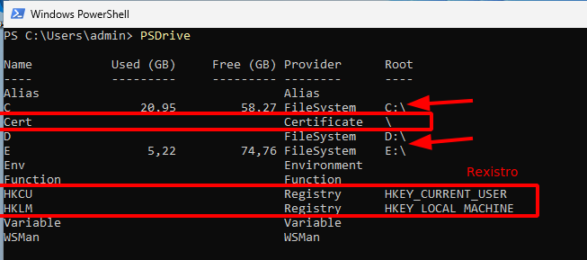
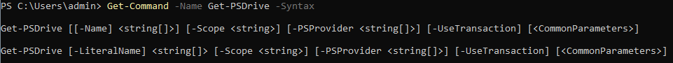
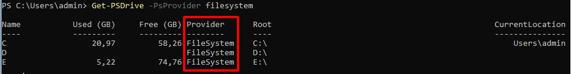

# PowerShell: Unidades
As unidades en powerShell son unha ubicación de almacén de datos, que pode ser:
+ Unidades do **sistema de arquivos**: C:  ,   D:  , ...
+ Unidades do Rexistro: **HKLM:**  ,    **HKCU:**
+ Unidade de certificados: **cert:**

Podemos ver as unidades das que dispoñemos co comando:
```PowerShell
Get-PSDrive
```
Un exemplo do meu equipo:



# Acceder á axuda do comando
Para acceder á axuda dun comando debo empregar o cmdlet **Get-Command**
```PowerShell
Get-Command -Name Get-PSDrive - Syntax
```
Na saída amosa o seguinte:


Entón por exemplo, se quero amosar as unidades que son so de sistema de arquivos, indicaría que son do **provider** **filesystem** soamente:



[1] Máis información en Adición e eliminación de unidades en PW: https://learn.microsoft.com/es-es/powershell/scripting/samples/managing-windows-powershell-drives?view=powershell-7.3

# Exercicios
1. Amosa as unidades que existen no teu PC, e indica de que proveedor son.
1. Fai unha listaxe agora das unidades do rexistro "registry" soamente.
1. Amosa a sintaxe do comando Get-PsDrive. 
