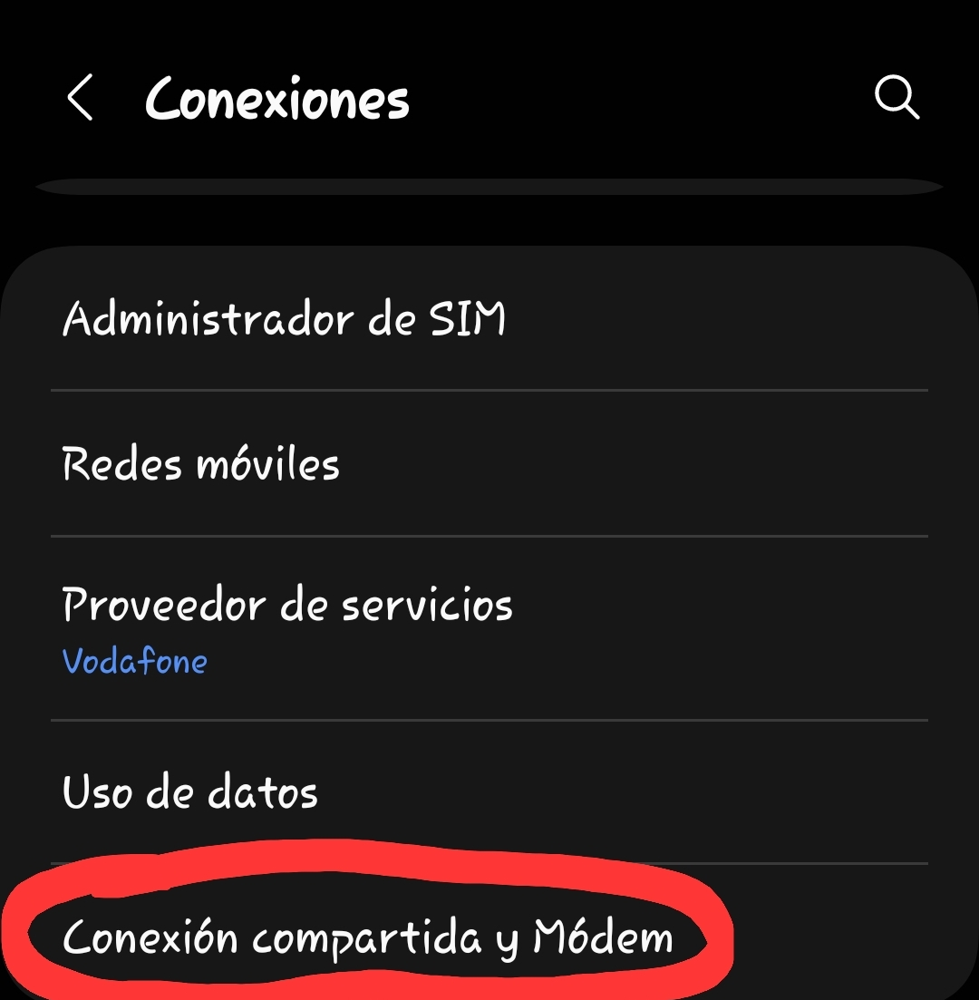
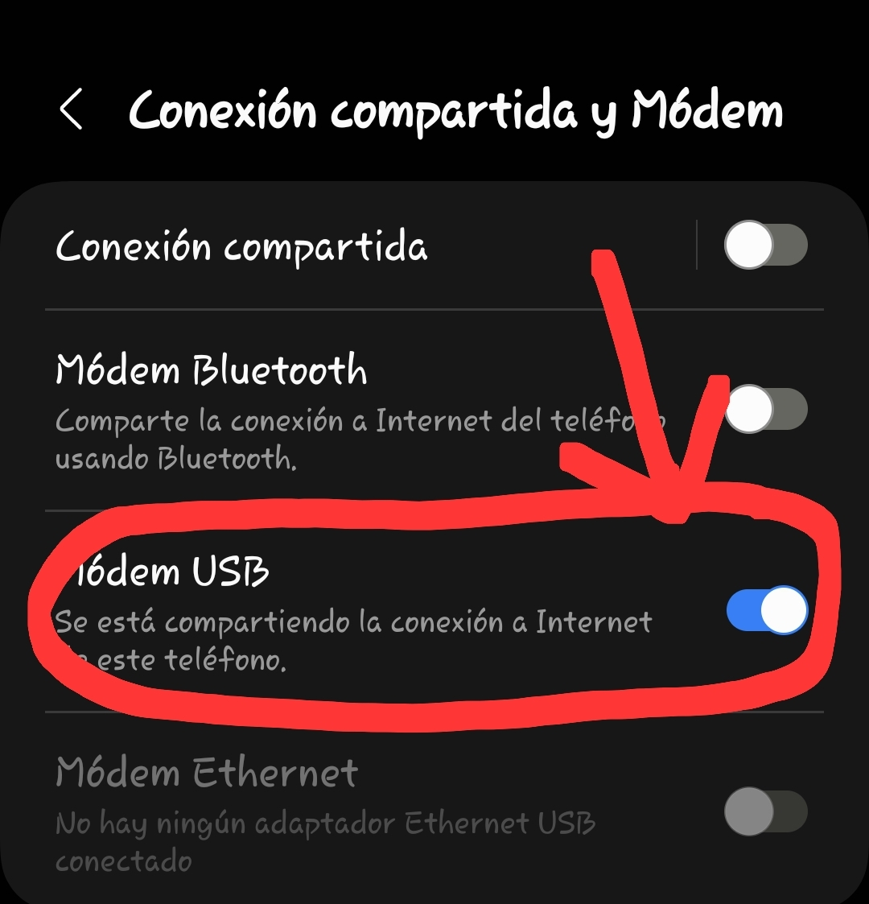
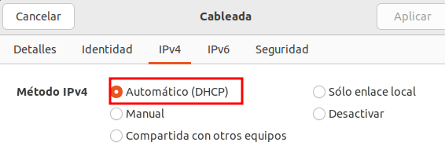

## Conectar a internet a través do móbil por USB

#####  Paso 1: Conectar o móbil con cable ao ordenador

Accedemos á Configuración ao apartado **CONEXIONES**:

E logo configuramos:

Logo na configuración de IP  collemos DHCP: 

E podemos abrir o CMD e poñer:

`ping www.google.es`

para comprobar que xa estamos conectados a Internet.