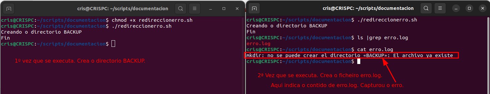

## Bash: Redireccións >, 2>

É posible indicar onde queremos que se mostren os resultados da execución dun comando, por defecto son:

+ entrada estándar - (stdin) - 	**0	teclado**

+ salida estándar - (stdout) - 	**1	pantalla**
+ erro  estándar  - (stderr)	 -  **2	pantalla**


##### **>** redirecciona a saída do comando anterior a un ficheiro.
Se o ficheiro non existe créao e si existe machaca o contido anterior polo novo.

`nano ola.sh`

```bash
#!/bin/bash

# Ficheiro que crea un ficheiro con echo

echo Ola que tal? > saudo.txt

echo Fin
```
Neste exemplo, redireccionada a frase "Ola que tal?" e crea un ficheiro chamado *saudo.txt*

A saída sería como sigue:

```cmd
~/scripts/documentacion$ ./ola.sh
Fin
~/scripts/documentacion$ cat saudo.txt 
Ola que tal?
~/scripts/documentacion$
```

##### >> engade a saída do comando anterior ao ficheiro que se lle indique. 
Se o ficheiro non existe créao e si existe engade o contido ao final do ficheiro.

No seguinte exemplo, vése como na primeira liña, machaca o ficheiro saudo.txt anterior.

E no segundo echo, engade a saída do echo ao final do ficheiro.

```bash
#!/bin/bash

# Ficheiro que crea un ficheiro con echo

echo Hoxe é un día moi productivo. > saudo.txt

echo Estamos aprendendo uns comandos moi interesantes. >> saudo.txt

echo Fin
```
A saída sería a seguinte:
Créase o ficheiro con **nano**, dámoslle permisos de execución con **chmod**, ao chamar o ficheiro:
+ `
echo Hoxe é un día moi productivo. > saudo.txt`: Machaca o contido de saudo.txt en caso de que existira e se non existía créao. Grava dentro o contido *"Hoxe é un día moi productivo"*.
+ `echo Estamos aprendendo uns comandos moi interesantes. >> saudo.txt`: Engade ao final do ficheiro **saudo.txt** o texto *"Estamos aprendendo uns comandos moi interesantes."*.

Pode verse ao facer **cat saudo.txt** o contido do ficheiro e que contén o que se indicou sobre estas liñas.

```bash
~/scripts/documentacion$ nano redireccion.sh 
~/scripts/documentacion$ chmod +x redireccion.sh 
~/scripts/documentacion$ ./redireccion.sh 
Fin
~/scripts/documentacion$ ls -l | grep saudo.txt 
-rw-rw-r-- 1 cris cris  82 feb 26 10:47 saudo.txt
~/scripts/documentacion$ cat saudo.txt 
Hoxe é un día moi productivo.
Estamos aprendendo uns comandos moi interesantes.
~/scripts/documentacion$ 
```
##### **2>** redirecciona o erro

No seguinte script crea un directorio. O que pasa que a segunda vez que o crea dará un erro, que en vez de amosarse por pantalla se garda no ficheiro **erro.log**.
```bash
#!/bin/bash

# Crea un directorio chamado BACKUP se xa existe, lanza un erro ao ficheiro docstxt\erro.log

echo Creando o directorio BACKUP

mkdir BACKUP 2> erro.log

echo Fin

```
**mkdir** crea o directorio.

**2>** redirecciona a saída a o ficheiro que se indica erro.log.

A saída da execución será a seguinte:



## Resumo de redireccións de entrada e de saída

Pode resumirse na seguinte táboa:

---
Carácter            Resultado
---
+ **comando < fichero**	--- Toma a entrada do ficheiro, é dicir, a entrada é o contido do ficheiro.
+ **comando > fichero**	---	Envía a **saída** do comando a un ficheiro; sobreescribe o contido do ficheiro e se non existe créao.
+ **comando 2> fichero**	---	Envía a **saída de erro de comando** a un ficheiro 
+ **comando >> fichero**	---	Engade a saída do comando ao final do ficheiro
+ **comando << etiqueta**	---	Toma a entrada para o comando as seguintes liñas que se escriban ata un final de etiqueta exemplo, `cat << EOF` le a entrada ata que aparece **EOF**.
+ **comando 2>&1**	---	Envía a **saída de erro* á saída estándar(o 1 e o 2 poden ser reemplazados por outro descritor de ficheiro, por exemplo 1>&2)
+ **comando &> fichero**	---	Envía **a saída estándar e a saída de erro** a un ficheiro; equivale a ***comando > fichero 2>&1***
+ **comando1 | comando2**	---	pasa á saída do comando 1 á entrada do comando 2 (pipe) ou (tubería)

Exemplos:

`ls hola 2> /dev/null` - Envía a saída de erro ao lixo. Non se amosa en ningures.

`ls -l /etc pepe > saidanormal 2> errosaida` - Envía a saída normal ao ficheiro *saidanormal* e a saída de erro a *errosaida*

`ls -l /etc pepe > saidanormaleERRO 2>&1` - Envía a saída normal e a saída de erro ao ficheiro *saidanormaleERRO*

`ls -l /etc pepe &> saidanormaleERRO ` - Fai o mesmo que o anterior. Envía a saída normal e a saída con erro ao ficheiro  *saidanormaleERRO*

`cat /etc/group > /dev/tty3` - Envía a saída ao terminal **tty3** . Co comando `tty` podemos mostrar na terminal que estamos.

`cat << END` - Lee información do teclado ata que escribamos a palabra END.

### Comandos útiles con tuberías (pipes) e redireccións

`tee` - copia a entrada estándar á saída estándar e tamén ao ficheiro indicado como argumento.
```bash
ls -l | tee lista.ficheiros | less
```
Amosa a saída de  **ls -l** páxina a páxina e ademais almacénaa en **lista.ficheiros**.
`tee -a` - non sobreescribe o ficheiro engade información ao final.
